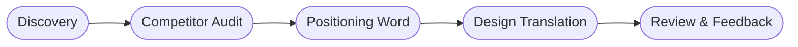

# Positioning for Web Agencies  
**Thesis:** Occupy a unique position in the customer’s mind【8†L38-L41】.  
**Principles:**  
- *Perception=Reality:* design to fit users’ mental image【7†L49-L51】.  
- *Simplicity:* one clear idea (LESS is more)【7†L44-L47】.  
- *Outside-In:* start from customer perceptions, not product features【5†L21-L27】.  
- *Differentiate:* avoid category clichés; find a gap【8†L51-L54】.  
- *Niche Focus:* address a specific target to be memorable.  
- *Be First (or Unique):* strive to own a category or trait.  

**Rules (Claude):** Gather category + 5 comps; note their colors, slogans, imagery. Identify overlaps vs gaps. Choose one positioning word/phrase. Map it to design (tone, fonts, colors, imagery, motion).  

**Validation:** Hide logos: if design seems generic or swappable with competitors, fail. Add a unique hook.  

**Prompts:** e.g. “List 5 competitors and their key themes.”  

**Checks:** Require client sign-off on positioning; competitor audit done; iterate until distinct.  

**Sources:** Ries & Trout, *Positioning*【8†L38-L41】【7†L49-L51】.