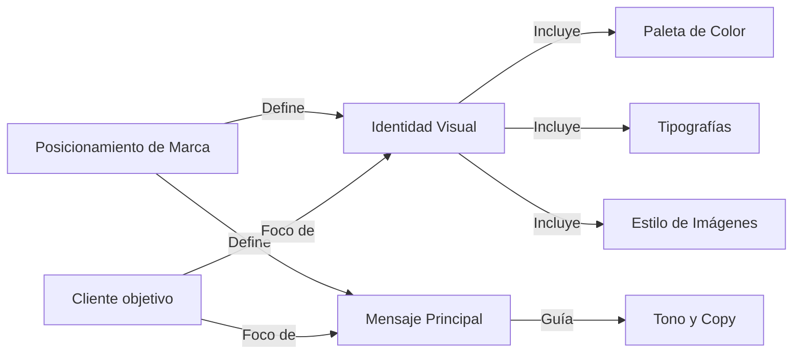
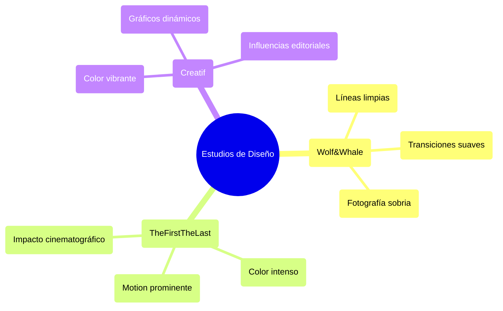
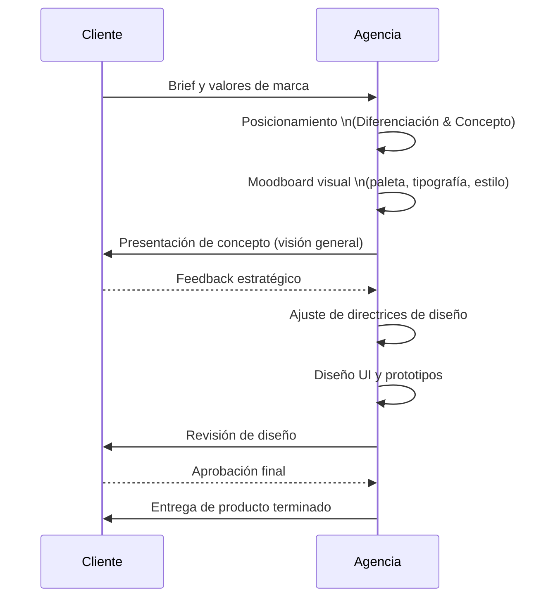

# Informe Ejecutivo – The Brand Gap aplicado a agencias top

**Resumen:** *The Brand Gap* de Marty Neumeier nos enseña que una **marca** es la distancia entre la estrategia empresarial y la experiencia de cliente. Las agencias más destacadas operan cerrando esa brecha con creatividad y rigor estratégico. Para igualar estudios como Wolf&Whale, TheFirstTheLast o Creatif, debemos traducir cada valor y posicionamiento de marca en decisiones de diseño concretas. Esto implica asegurar una diferenciación clara, una narrativa coherente y una coherencia visual impecable en cada componente (tipografía, color, imágenes, motion, etc.). En este informe hemos destilado *8 principios operativos clave* extraídos de *The Brand Gap*, explicando cada uno (qué es, por qué importa, cómo aplicarlo mediante reglas operativas para Claude, ejemplos concretos de transformación de estrategia a diseño y una breve justificación). Luego ofrecemos módulos listos para prompts de IA (traducción de posicionamiento, checklist de marca, guión de validación con el cliente, auditorías automáticas con umbrales cuantitativos), modos de fallo comunes con soluciones, una hoja de trucos (“cheat-sheet”) y un workflow de 30 pasos para integrar estos principios. Finalmente comparamos cómo Wolf&Whale, TheFirstTheLast y Creatif ponen en práctica estos principios (firma visual, estilo de imágenes, motion, etc.), e incluimos diagramas de workflow y entidad-valor para ilustrar el proceso completo.  

En conjunto, este reporte sirve como **sistema operativo** para diseñar webs con visión de agencia top: pasando del posicionamiento estratégico hasta la implementación front-end, con criterios claros en cada etapa.

---

## Principios clave de *The Brand Gap* aplicados al diseño web

A continuación, 9 principios concretos (tomando y extendiendo los conceptos de *The Brand Gap*) que conectan la estrategia de marca con decisiones visuales y de copy. Cada principio incluye: definición breve, importancia, reglas operativas para Claude (inputs, criterios de aprobación o rechazo), ejemplo de traducción de posicionamiento a diseño, y justificación.

1. **La marca es percepción:** *“Tu marca no es lo que dices, es lo que perciben.”*  
   - **Definición breve:** La marca existe en la mente del cliente. No es un logo o un producto, sino la experiencia y emoción que genera.  
   - **Por qué importa:** Si no definimos claramente *qué* sentir o pensarán los usuarios, cualquier diseño bonito será vacío. Una marca fuerte controla esa percepción.  
   - **Reglas para Claude:**  
     - **Inputs:** Valores de marca, propuesta única, target, referencias de competidores.  
     - **Chequeos:** ¿Está claro qué sensación o idea queremos que asocie el usuario? ¿El concepto de marca es único y memorable?  
     - **Criterio:** Debe definirse *una sola idea/valor principal* que la marca quiere poseer en la mente del público. Si no, falla.  
   - **Ejemplo de aplicación:** Si el posicionamiento es “Lujo accesible”, el sitio usará una tipografía elegante pero con amplio espacio (sugerencia de lujo), colores neutros con un toque cálido (accesible), y copy que subraye exclusividad a precio justo.  
   - **Racional:** Centrar el diseño en una sola percepción (por ejemplo, “confianza”, “innovación” o “cercanía”) guía todas las decisiones visuales. Evita la mezcla caótica de mensajes y crea coherencia inmediata en el usuario.

2. **Diferenciación extrema:** *“Cuando todos zig, tú zag.”*  
   - **Definición:** Encontrar el ángulo único donde la marca no compita cara a cara, sino aporte algo distinto.  
   - **Por qué importa:** En una categoría homogénea (por ejemplo, fintech que hablan de “seguridad” y usan azul), destacarse es clave. Sin diferencia clara, la web se confunde con decenas más.  
   - **Reglas para Claude:**  
     - **Inputs:** Análisis de 3-5 competidores (colores, layouts, mensajes).  
     - **Chequeos:** ¿Qué patrones repiten los competidores? ¿Qué hueco o percepción dejan sin explorar?  
     - **Criterio:** Seleccionar al menos un rasgo (tono, metáfora visual, estructura) que se *omite* en la competencia y alinearlo con el concepto de marca. Si el diseño copió un patrón común (colores, clichés), falla.  
   - **Ejemplo:** Si todas las agencias de abogados web usan tonos oscuros y mucha seriedad, una firma que quiera ser “accesible y humano” optará por imágenes luminosas de personas cotidianas y tipografía sin serif (contra la norma del sector).  
   - **Racional:** Aplicar rigor de diferenciación evita que el sitio resulte genérico. Obliga a romper moldes familiares con la categoría, lo que en diseño puede traducirse en desde elección de color atípica hasta estructuras de navegación inusuales, reforzando la identidad propia.

3. **Concepto dominante:** *“Idea antes que diseño.”*  
   - **Definición:** Todo el sistema visual debe girar alrededor de un concepto creativo central (metáfora, historia, emoción).  
   - **Por qué importa:** Las webs de agencia top no nacen ordenando secciones al azar: primero surge un hilo conductor (ej. “rendimiento sin fricción”, “viaje espiritual” o “arte en tecnología”), luego cada elemento respira ese concepto.  
   - **Reglas para Claude:**  
     - **Inputs:** Frase-concepto, metáfora visual (por ejemplo: “la web como un río fluido”).  
     - **Chequeos:** Cada sección y recurso visual responde al concepto. ¿Causa la misma atmósfera? ¿Repite la metáfora de forma coherente?  
     - **Criterio:** Si el concepto no inspira las decisiones clave (espaciados, composición, imágenes), falla. Necesita ser traducido explícitamente en reglas de diseño (p. ej. “mucho espacio negativo para fluidez”).  
   - **Ejemplo:** Concepto “precisión clínica” puede derivar en un layout de rejilla perfecto, tipografías geométricas y animaciones milimétricamente temporizadas. Otra marca con concepto “lujo silencioso” usaría gran espaciado, imágenes desenfocadas sutiles y tipografías finas.  
   - **Racional:** Un concepto fuerte unifica el sitio. Todas las decisiones (espaciado, contraste, ritmo visual) se justifican mediante ese concepto, garantizando un estilo único en lugar de un mero collage de buenos componentes.

4. **Narrativa integrada:** *“Una buena historia vende; un catálogo, no.”*  
   - **Definición:** En lugar de secciones desconectadas (“sobre nosotros”, “servicios”, “contacto”), el sitio debe narrar una historia atractiva que guíe al usuario a través de la propuesta de valor.  
   - **Por qué importa:** Las mejores webs *cuentan* la marca: plantean un “viaje del cliente” donde este es protagonista y la marca, guía. Así cada párrafo y título refuerza la propuesta.  
   - **Reglas para Claude:**  
     - **Inputs:** Puntos clave de conversión, objeciones del cliente, beneficios principales.  
     - **Chequeos:** El contenido sigue un arco narrativo (p.ej., dolor del cliente → solución de marca → prueba social → CTA). ¿Evita hablar solo de la empresa sin conectar con el cliente?  
     - **Criterio:** Todo texto debe tener un propósito: informar o persuadir al cliente. Si una sección no conecta con la historia (ni educa ni emociona), sugiere eliminarla.  
   - **Ejemplo:** En vez de “Nosotros” genérico, un headline como “Nunca más la logística será un dolor de cabeza” (enfatiza dolor del cliente), seguido de cómo el servicio lo resuelve. Así el copy guía al lector paso a paso.  
   - **Racional:** Vincular cada pieza de contenido crea fluidez en la conversión. Claude debe evitar bloques de “texto de relleno” y estructurar el sitio como diálogo con el usuario, usando frases simples y gancho emocional para que el mensaje cale.

5. **Consistencia visual:** *“Todo suma: cada detalle refuerza la marca.”*  
   - **Definición:** La identidad visual (colores, tipografías, ritmo, formas) se aplica sistemáticamente en toda la web, reforzando la percepción deseada.  
   - **Por qué importa:** Inconsistencias restan credibilidad. En cambio, un sistema cohesivo (p.ej. mismo estilo de iconos, mismos espacios, una paleta definida) hace que el sitio “se sienta” como una unidad cuidada.  
   - **Reglas para Claude:**  
     - **Inputs:** Paleta de colores principal, tipografías seleccionadas, estilo de imágenes/ilustraciones, ejemplos de iconografía o texturas.  
     - **Chequeos:** ¿Se usa la paleta de manera controlada (p.ej., solo 2-3 colores destacados)? ¿Mantiene coherencia la tipografía (no mezclar demasiadas familias)? ¿Los componentes (botones, formularios) siguen el mismo patrón de estilo en todo el sitio?  
     - **Criterio:** El diseño debe pasar un *estándar de consistencia*: por ejemplo, “>= 90% de los títulos usan la fuente A y color X, no más de 3 colores en total, e iconos del mismo set”. Si hay elementos sueltos de otro estilo, falla.  
   - **Ejemplo:** Si la marca usa una tipografía geométrica azul y blanca, Claude aseguraría que casi todo el texto importante sea de esa fuente, los botones tengan esquinas del mismo radio, etc. Un CTA inesperado en rojo chillón o un párrafo con serif romperían la armonía.  
   - **Racional:** Este rigor hace que el diseño “se sienta caro”. Cada sección, botón o ilustración respira el mismo ADN. Así el visitante percibe coherencia sin esfuerzo consciente, reforzando la solidez de la marca.

6. **Iteración y validación temprana:** *“Idea probeada > diseño perfecto.”*  
   - **Definición:** Antes de implementar cada idea visual o textual, es fundamental testearla (internamente o con usuarios) para confirmar que cumple la intención de marca.  
   - **Por qué importa:** El mayor riesgo no es mal diseño técnico, sino mal encuadre conceptual. Validar conceptos, prototipos o copys asegura que estamos alineados con la marca y el público desde temprano.  
   - **Reglas para Claude:**  
     - **Inputs:** Esquemas de pruebas rápidas, feedback del cliente, data de mercado.  
     - **Chequeos:** ¿Cada propuesta de diseño tiene base en feedback (p.ej. tests A/B, focus group) o alineación con el brief? ¿Se revisó internamente la consistencia con el posicionamiento?  
     - **Criterio:** Requiere al menos 1 iteración de feedback antes de “cerrar” un diseño final. Por ejemplo, versiones alternativas de un hero que se comparen con métricas (tiempo de atención, click). Sin ello, el diseño no avanza.  
   - **Ejemplo:** Antes de decidir un esquema de color definitivo, se pueden mostrar 2 opciones al cliente o target: si elige la opción B (más cálida y cercana), se analiza por qué: ¿refuerza mejor el concepto “accesibilidad”? El diseño final se ajusta según el hallazgo.  
   - **Racional:** Simples tests previenen rehacer el 80% del trabajo tarde. Claude debe asegurarse de no “validar” conceptos solo internamente: involucrar al cliente o indicadores objetivos para ver si el concepto (y su reflejo visual) resuena con la audiencia.

7. **Cultivo continuo:** *“Construir marca es maratón, no sprint.”*  
   - **Definición:** La marca evoluciona con la empresa. El diseño debe ser flexible y pensado para escalar, permitiendo ajustes según cambios de mercado o feedback futuro.  
   - **Por qué importa:** Las marcas top no quedan estáticas: un framework visual robusto permite actualizar imágenes, colores o copy sin romper identidad. Pensar “escala” ahorra tiempo e inconsistencias luego.  
   - **Reglas para Claude:**  
     - **Inputs:** Guía de estilo inicial, posible roadmap (nuevos productos o mercados).  
     - **Chequeos:** ¿El sistema de diseño (espaciados, rejillas, componentes) contempla variaciones futuras (p.ej. más secciones, idiomas)? ¿Existen reglas claras para adaptarlo sin inventar de cero (como variables CSS)?  
     - **Criterio:** Debe poder generarse al menos 3 páginas adicionales (por ej. casos de estudio o productos nuevos) usando el mismo sistema sin romper la línea visual. Si cada nueva página requiriera re-definir CSS complejo, falla.  
   - **Ejemplo:** Si la marca crecerá a 3 países con idiomas distintos, el diseño prediseñado debe soportar textos más largos o diferentes alfabetos sin romper el layout. Por ejemplo, el menu horizontal se convierte responsivo o la fuente admite acentos especiales sin problemas de kerning.  
   - **Racional:** Sin esto, cada actualización será costosa y arriesgada. Claude debe verificar que cada elemento (colores, clases CSS, tamaños) se aplique de manera modular, y que existan “extras” definidos (espacio extra para texto, fondo neutro alternativo) para iterar sin reconstruir todo.

8. **Balance Razón–Emoción:** *“Diseño, no decore, persuada.”*  
   - **Definición:** Un buen sitio conecta ambos hemisferios: la parte racional (beneficios claros, datos, simple navegación) y la parte emocional (branding visual, storytelling).  
   - **Por qué importa:** Una marca top no depende solo de un buen copy “venta” ni solo de un diseño hermoso. Debe convencer con hechos (credibilidad) y al mismo tiempo inspirar con estética (emoción).  
   - **Reglas para Claude:**  
     - **Inputs:** Promesas centrales de la marca (ej. “resultados” vs. “experiencia”), valores emotivos, evidencia/pruebas sociales.  
     - **Chequeos:** ¿Cada sección aborda un “por qué creerlo”? (e.g. testimonios, datos). ¿Cada mensaje emocional (p.ej. hero emotivo) está sustentado con información concreta en otra sección?  
     - **Criterio:** Debe haber un  balance medible: por ejemplo, en cada scroll de 5 pantallas, al menos 2 ofrecen razones (beneficios claros, números, testimonios) y 3 apelan a emoción (imágenes inspiradoras, frases inspiradoras). Si falta uno, hay falla.  
   - **Ejemplo:** Si el mensaje central es “Transformamos tu negocio digital”, se muestra en hero una imagen potente y claim inspirador. Luego, en la sección siguiente, enumeramos características tangibles y casos de éxito que validan esa promesa.  
   - **Racional:** Un visitante primero siente (diagrama visual/copy llamativo) y luego busca pruebas. Claude debe asegurar que ni la emoción sea vacía ni la información abrumadora; ambos aspectos deben reforzarse mutuamente en la estructura del sitio.

9. **Obsesión por el detalle:** *“Cada píxel cuenta.”*  
   - **Definición:** En agencias de élite no hay huecos sin justificar: cada separación, color, peso tipográfico e interacción tiene intención.  
   - **Por qué importa:** En el nivel top, la diferencia está en pulir hasta lo mínimo. Eso eleva la percepción de calidad: un hover suave en un botón, un microespacio exacto, animaciones hechas con propósito.  
   - **Reglas para Claude:**  
     - **Inputs:** Guidelines de animación (duración, easing), escala tipográfica y de espacios, definiciones de micro-interacciones.  
     - **Chequeos:** ¿El sitio considera estados (hover, foco) para botones? ¿Los márgenes internos/exteriores están cuantificados (e.g. múltiplos de 8px)? ¿La animación refuerza la marca (no solo adorno)?  
     - **Criterio:** Requiere que el 100% de componentes reutilizables tengan definiciones completas (estados y comportamientos) y el espaciado siga un sistema (p.ej. 8px * n). Si hay inconsistencias (p.ej. botones con padding 10px vs 12px sin razón), falla.  
   - **Ejemplo:** Un micro-hover en un icono puede enfatizar la “marca silenciosa” de un banco (por ejemplo, un sutil cambio de color que transmita calma). Espacios constantes (8,16,32px) garantizan armonía en columnas y filas, sin saltos raros entre secciones.  
   - **Racional:** Este nivel de perfección es lo que convierte un buen diseño en una experiencia premium. Cada detalle menor reforzado (ej. microinteracciones suaves o gráficas animadas que no distraigan sino que sumen) se coordina con la identidad global.

---

## Módulos y herramientas operativas para Claude

Para implementar estos principios con ayuda de IA (Claude), proponemos los siguientes módulos de prompts y plantillas:

- **A. Position-to-Visual Translator (Traducción de Posicionamiento a Visual):** Prompt para generar directrices visuales a partir del posicionamiento de marca. Ejemplo de plantilla:  
  ```
  Prompt: Tengo la marca [Nombre] que se posiciona como "[Percepción clave]". El target es [descripción]. Quiero una lista de recomendaciones de diseño gráfico y copy para este sitio web: 
  1. Paleta de colores 
  2. Estilo tipográfico (familias, tamaños) 
  3. Composición principal (layout, uso de espacio) 
  4. Ejemplos de imágenes o estilo fotográfico 
  5. Ideas de tono de voz del copy. 
  Asegúrate de alinear cada recomendación con la percepción deseada y diferenciarla de competidores genéricos.
  ```  
  *Ejemplo de uso:* Si el posicionamiento es “tecnología empática”, el prompt obligaría a Claude a sugerir colores cálidos, tipografías redondeadas, fotografías con personas reales usando la tecnología, etc.

- **B. Brand-Translation Checklist:** Lista de verificación para revisar que el diseño respete la marca. Ejemplo de elementos:  
  - `Identidad coherente:` ¿Coincide la paleta de colores con el manual de marca?  
  - `Jerarquía de titulares:` ¿La escala tipográfica refuerza el tono (autoritario vs amigable)?  
  - `Narrativa alineada:` ¿Cada sección responde a un beneficio o emoción principal de la marca?  
  - `Consistencia de estilo:` ¿Formas, iconos e ilustraciones mantienen un mismo estilo gráfico?  
  - `Relevancia de imágenes:` ¿Las fotografías/ilustraciones elegidas reflejan la personalidad de la marca y perfil de usuario?  
  - `Microanimaciones:` ¿Están al servicio del concepto (p.ej. fluidas para marca “suave”, dinámicas para marca “energética”)?  
  - `Copy:** ¿El mensaje principal destaca el diferencial de marca y no frases genéricas? 
  - `Accesibilidad:` ¿Cumple con contrastes mínimos y es legible en todos los dispositivos? (umbral: WCAG AA)  
  Cada ítem se marca como Sí/No; cualquier “No” implica una iteración de diseño.

- **C. Guión de validación con el cliente:** Serie de preguntas y puntos para presentar y obtener “sign-off” en la dirección creativa.  
  Ejemplo de guión:  
  1. **Visión General:** “¿Resuena con su idea de la marca esta dirección conceptual? (usar palabras del cliente).”  
  2. **Percepción Clave:** “Este diseño pretende que el usuario perciba [palabra clave]. ¿Coincide con lo que busca?”  
  3. **Narrativa:** “Nuestro hero-copia/fotografía cuenta la historia [breve]. ¿Se ajusta a su forma de presentarse?”  
  4. **Colores y Tipografía:** “Elegimos [colores] y [fuentes] porque transmiten [valor]. ¿Le resultan adecuados y diferenciadores?”  
  5. **Componentes:** Revisar botones, iconos, etc: “¿Estos elementos se alinean con su identidad visual existente?”  
  6. **Siguientes Pasos:** “Si este concepto le parece correcto, procederíamos con [acciones]. ¿Algo que quisiera ajustar antes?”  
  En resumen, buscar la aprobación formal de conceptos clave antes de pasar a la fase de construcción.

- **D. Auditorías automatizadas (checkpoints cuantitativos):** Cinco chequeos medibles para validar aspectos concretos (se pueden automatizar con scripts o revisar con herramientas) con umbrales. Ejemplos:  
  1. **Ratio de contraste:** Todos los textos principales ≥ 4.5:1 respecto al fondo (pasa si cumple WCAG AA).  
  2. **Uso de colores:** No usar más de 3 colores de marca diferentes en UI (pasa si ≤3).  
  3. **Modularidad CSS:** Todos los tamaños (márgenes/paddings) son múltiplos de una base (ej. 8px) con variaciones definidas (pasa si >90% de las medidas obedecen esta regla).  
  4. **Velocidad de carga inicial:** Página principal < X segundos (pasa si cumple target de performance).  
  5. **Originalidad visual:** Ratio de imágenes/noise vs stock: al menos el 70% de las imágenes principales deben ser propias o editadas (pasa si hay <30% stock directo).  
  Estos checks dan un puntaje numérico o sí/no. Se fijan umbrales (por ejemplo, 80% elementos consistentes) que definan paso/aprobación. Si no se cumple alguno, se vuelve a iterar.

---

## Modos de falla comunes y cómo mitigarlos

1. **Diseño “de catálogo”:** El equipo crea páginas funcionales sin un hilo narrativo. *Mitigación:* Volver al posicionamiento; forzar al copywriter a reescribir textos centrados en el usuario.  
2. **Desfase con el cliente:** Presentar un prototipo final sin aprobación conceptual. *Mitigación:* Usar el guión de validación para checkpoints intermedios.  
3. **Estilo incoherente:** Se mezclan estilos (p.ej. fotos hiper-realistas con ilustraciones estilo doodle). *Mitigación:* Aplicar la checklist de consistencia visual: definir un único estilo gráfico o justificar cada mezcla.  
4. **Sobrecarga de información:** Se intenta explicar todo de golpe, generando páginas densas. *Mitigación:* Emplear Progressive Disclosure (mostrar solo lo esencial y permitir profundizar si el usuario quiere), priorizando claridad.  
5. **Ignorar dispositivos móviles:** Diseño complejo que falla en mobile. *Mitigación:* Revisar cada principio en mobile (cada criterio, jerarquía, copy) como un requisito desde el inicio (“Mobile First”).  
6. **Tipografía genérica:** Uso de fuentes muy comunes (p.ej. Inter) por conveniencia. *Mitigación:* Aplicar reglas positivas de tipografía: asignar fuentes basadas en personalidad de marca (e.g. serif clásico para “tradicional”, grotesk para “moderno”), no sólo evitar “Inter” sino seleccionar activamente.  
7. **Falta de filtro:** Agregar secciones “por si acaso” sin aporte de marca. *Mitigación:* Cada sección nueva debe justificar su valor (informativo o persuasivo). Si no, eliminarla para mayor impacto de lo esencial.

---

## Cheat-Sheet y Workflow de 30 pasos

### Hoja rápida de referencia (página única)

- **Estrategia primero:** Siempre definir percepción clave y hueco diferenciado **antes** de diseño.  
- **Concepto claro:** Unificar bajo una metáfora/idea central. No diseñar sin esto.  
- **Colores & Tipografía:** Elegir 2-3 colores y máximo 2-3 familias tipográficas. Alinearlas con emociones de marca.  
- **Jerarquía visual:** Usar tamaño y peso para guiar la mirada: un título súper grande, subtítulos medianos, cuerpo estándar.  
- **Espaciado modular:** Definir un “grid” o sistema de espaciados (ej. múltiplos de 8px) y ceñirse a él.  
- **Imágenes con propósito:** Si no hay fotos propias, usar ilustraciones o mockups en lugar de stock cliché. Máximo 2-3 fotos de stock (y editarlas).  
- **Copy centrado en cliente:** Evitar “nosotros”. Cada título debe hablar de beneficio o problema del usuario.  
- **Animaciones intencionales:** Microinteracciones suaves (50–200ms), nada distractor. Parallax o video sólo si refuerzan concepto.  
- **Validación continua:** Testear conceptos y prototipos antes de pulir visuales finales. Iterar con feedback real.  
- **QA exhaustivo:** Repasar contraste, accesibilidad, responsividad. Perfilar detalles: mismos bordes, alineación exacta.  
- **Entrega:** Incluir guidelines cortas (colores hex, tipografías, ejemplos de uso) para el dev.  
- **Iterar tras publicación:** Recoger datos de uso y planificar ajustes de marca a futuro (fase de cultivo).

### Flujo de trabajo detallado (30 pasos)

1. **Recibir brief:** Anotar objetivos del cliente, target, competidores y datos clave.  
2. **Discovery interno:** Investigar mercado, entrevistas rápidas al cliente (Preguntas Fase 0).  
3. **Posicionamiento:** Definir frase-posicionamiento y hueco único (usando herramienta Differentiation Audit).  
4. **Pitch conceptual:** Proponer 2-3 metáforas/ideas clave que reflejen el posicionamiento.  
5. **Validación interna:** Discutir internamente qué concepto es más original y alineado.  
6. **Reunión con cliente:** Presentar concepto ganador (punto, metáfora y palette inicial) con guión de sign-off.  
7. **Feedback:** Ajustar concepto según feedback (si rechazan, iterar conceptualmente antes de diseñar).  
8. **System Design – moodboard:** Reunir imágenes y colores que encajen con la idea.  
9. **Definir paleta:** Seleccionar colores principales y secundarios según metáfora (contrastes apropiados).  
10. **Escoger tipografías:** Elegir familias tipográficas (serif vs sans, grosores) basadas en personalidad de marca.  
11. **Grid Layout:** Diseñar la rejilla base (columnas, filas, espacios).  
12. **Sketch de secciones clave:** Bocetar la página de inicio: hero, beneficios, prueba social, CTA.  
13. **Copy inicial:** Redactar títulos y subtítulos centrados en usuario para esas secciones (Storytelling básico).  
14. **Revisión conceptual:** Asegurar coherencia entre copy-imágenes-concepto (Checklist Visual).  
15. **Primer prototipo:** Montar versión inicial en baja fidelidad (wireframe/baja).  
16. **Testing rápido:** Mostrar prototipo a colegas o al cliente para feedback general (valida flujo y concepto).  
17. **Iterar prototipo:** Ajustar estructura/narrativa según comentarios.  
18. **Primera versión visual:** Aplicar estilos finales sobre la estructura ajustada (tipos, colores reales, imágenes).  
19. **Animaciones básicas:** Agregar microtransiciones (hover, entrada) definidas en segundos y easing.  
20. **Autochequeo:** Aplicar checklist de marca (colores, fuentes, consistencia de estilo) y auditorías (contraste, espaciados).  
21. **Iteración de detalle:** Afinar márgenes, corregir espacios, padronizar tamaños de texto según el sistema.  
22. **Revisión interna:** Equipo evalúa la pulcritud visual y comunicación de la marca.  
23. **Pre-entrega al cliente:** Compartir prototipo cercano a final con guión (validación final del concepto refinado).  
24. **Recibir feedback:** Registrar cambios menores y aprobar ajustes.  
25. **Desarrollo frontend:** Entregar assets y specs al equipo dev (colores en código, fuentes, estilos de componentes).  
26. **QA de dev:** Revisar que la implementación respete cada regla (espaciados correctos, responsive, performance).  
27. **Prueba en vivo:** Testear interacciones reales, corregir bugs de UX (p.ej. menú que colapsa mal en móvil).  
28. **Entrega final:** Presentar sitio terminado al cliente con documentación breve de marca para actualización futura.  
29. **Monitoreo inicial:** Observar analíticas de interacción (tiempo en hero, clics en CTA) y planear iteraciones.  
30. **Refinamiento continuo:** Después del lanzamiento, actualizar contenidos/imágenes según desempeño, manteniendo los principios de marca.

```mermaid
flowchart LR
  A[Brief del cliente] --> B[Discovery y Posicionamiento]
  B --> C[Concepto creativo]
  C --> D[Reunión de aprobación]
  D --> E[Diseño de sistema visual (colores, tipografía)]
  E --> F[Wireframes y prototipos]
  F --> G[Testeo rápido/feedback]
  G --> H[Diseño UI completo]
  H --> I[Revisión y QA]
  I --> J[Desarrollo Frontend]
  J --> K[QA final y pruebas]
  K --> L[Lanzamiento]
  L --> M[Monitoreo & ajustes]
```



## Comparativa de agencias top (Wolf&Whale, TFTL, Creatif)

| Aspecto              | **Wolf & Whale**                                       | **The First The Last**                              | **Creatif**                                      |
|----------------------|--------------------------------------------------------|-----------------------------------------------------|--------------------------------------------------|
| **Firma visual**     | Estilo sobrio y minimalista. Paleta principalmente neutra (blanco, negro, grises) con un color acento limitado. Tipografía geométrica de líneas limpias. En general sensación de “calma ejecutiva” (p. ej. **Wolf&Whale** suele usar espacios blancos generosos y fuentes finas). | Estilo cinematográfico. Uso de gran espaciado y composiciones asimétricas. Colores intensos (a menudo degradados brillantes o acentos llamativos) sobre fondos oscuros o con texto blanco. Tipografías grandes y audaces (a veces sans serif impactante). Sensación de “drama editorial”. | Estilo editorial alegre. Paleta contrastante (blanco con colores pastel o brillantes). Frecuentes patrones gráficos (líneas, puntos) como “firma”. Tipografías modernas, a veces con serif artísticas. Layouts dinámicos con fotografías sobrepuestas y bloques de color. Sensación de “creatividad cálida”. |
| **Estrategia de imágenes** | Prefiere fotografías conceptuales mínimas o sets con pocos props, a menudo ambientes neutros. Edita las fotos con filtros suaves. Vídeos o cinemagraphs muy sutiles. Caso: portafolios con imágenes de arquitectura/espacios serenos. | Uso intensivo de fotografía profesional (frecuentemente moda, lifestyle). A menudo imágenes ocupando secciones completas en pantalla. Dramatismo visual con retoque de iluminación (e.g. cielos vibrantes). Video-backgrounds o hero loops cinemáticos son comunes. | Mezcla de fotos reales con ilustraciones. A veces usa escenas espontáneas pero con encuadres atrevidos (p.ej. ángulos inusuales). Introduce ilustraciones geométricas o collage digital para acentuar un estilo “fresh”. Muchas marcas ilustradas (p.ej. logos propios como motivos). |
| **Uso de motion**    | Animaciones discretas: microtransiciones de opacidad y desplazamiento muy suaves. Parralax mínimo. Focus en fluidizar el scroll y micro-feedback (botones que se agrandan suavemente al pasar). | Motion impactante: transiciones rápidas, uso de preloader animado, desplazamientos parallax pronunciados y efectos de rotación/escalado en elementos. Escenas cinemáticas con animaciones de texto (scratching), saturación de color dinámica en desplazamiento. | Motion equilibrado: con patrón similar a editorial. In/out fade, despliegue de secciones con pequeños movimientos (slide-in, fade-in). Animaciones de íconos ilustrativos o líneas que dibujan shapes al hacer scroll. Evita el parallax total, prefiere microanimaciones vinculadas al contenido (p.ej. numeros contando). |
| **Narrativa / estructura** | A menudo construyen el caso de negocio de forma lineal: problema del cliente → proceso de diseño de W&W → resultados. Con estudios de caso muy ilustrativos. En general, enfoque storyboard progresivo. | Narra con pasión: inicio teaser emocional (film-like hero) → beneficios visuales (gráficos o cifras) → llamada a la acción. Tiende a un “viaje cinematográfico”, donde cada scroll es un corte de escena. | Combina storytelling y estética: arranca con idea conceptual (hero creativo) y luego alterna secciones de imagen+texto con fondos de color. Su flujo suele ser más modular (alto-control de la narrativa), con momentos de “explosión gráfica” para resaltar valores de marca. |
| **Sistemas de firma**| Uso recurrente de patrones geométricos (a veces líneas paralelas o grid superpuesto tenuemente). Interacciones sign-off particulares (e.g. logo animado al cargar). Consistencia en elementos de transición (misma curvatura en scroll). | Emplean efectos reconocibles (p.ej., siempre animan títulos al aparecer con el mismo delay dinámico). Motivos gráficos como gradientes de marca extendidos a todos los botones. En varios sitios TFTL usan vectores de “rejilla digital” recurrentes. | Patron recurrentes: uso de bloques de color semi-transparente (marca de la casa). Botones con forma redondeada y swipe patterns únicos. Firmas visuales como “parrillas de puntos” que aparecen sutiles en background. Texturas puntuales en secciones clave. |

> **Diagrama comparativo (mermaid):** Un posible diagrama de relación de contenidos entre estos estudios.  


---

### Flujo de marca paso a diseño (diagrama propuesto)


**Mockups/Screenshots sugeridos:** (Se pueden generar diagramas esquemáticos o wireframes basados en los principios. Por ejemplo, ilustración de un “wireframe anotado” mostrando paleta de colores, familias tipográficas y estructura de rejilla. Dado que aquí no disponemos de imágenes reales, se sugiere al equipo crear bosquejos visuales siguiendo la paleta y composición descrita).

---

## Conclusiones

Aplicar *The Brand Gap* al diseño web implica convertir la estrategia de marca en cada decisión estética y de contenido. Este informe resume cómo hacerlo paso a paso: desde definir la percepción clave hasta ajustar cada pixel con intención. Siguiendo estas pautas, incluso un diseñador “uno a uno” puede aproximarse al trabajo de agencias de primer nivel. Wolf&Whale, TheFirstTheLast y Creatif son ejemplos de coherencia absoluta: su excelencia radica en traducir sinfonías de marca a experiencias digitales inolvidables. Este documento es su hoja de ruta, que Claude podrá usar para evaluar cada proyecto de branding digital y asegurarse de que ninguna decisión quede sin justificación estratégica.

