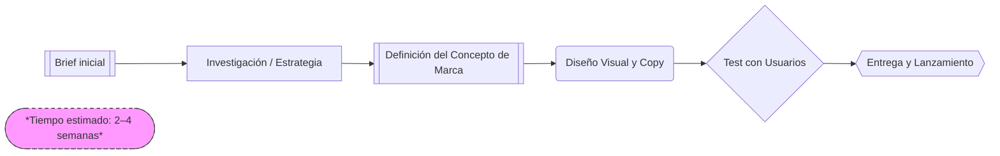

# Informe: *The Brand Gap* (Marty Neumeier)

**Resumen ejecutivo:** *The Brand Gap* plantea que la marca no es un logo ni un producto, sino la percepción integral que el público tiene de una empresa. Neumeier propone que para “cerrar la brecha” entre estrategia y diseño se necesitan cinco disciplinas clave: **diferenciación, colaboración, innovación, validación y cultivo** de la marca. En la práctica, esto significa definir claramente qué hace única a la marca (más que “ser mejor”, debe **ser diferente**), traducir esa estrategia en cada elemento visual y verbal con coherencia, colaborar entre equipos creativos y de negocio, probar ideas con usuarios reales, y mantener consistencia a lo largo del tiempo. La idea central es que **la claridad de la marca vence a la sofisticación vacía**: un mensaje simple y diferenciador genera confianza y recordación.  

---

## Principios operativos (disciplinas de la marca)

1. **Marca = Percepción**: La marca es “el sentimiento visceral” que queda en la mente del cliente【37†L0-L3】. No es sólo logo o producto, sino la suma de experiencias y promesas.  
   - *Claves:* Enfocar cada decisión en reforzar la “emoción” o “promesa” central de la marca. Evitar estilos visuales o mensajes que confundan esa percepción.

2. **Diferenciación antes que superioridad**: No basta con ser “mejor”; hay que **ser único**. Neumeier insiste en encontrar un espacio no ocupado en la mente del público.  
   - *Ejemplo:* Si todos los competidores usan azul y tipografías minimalistas, buscar un código distinto (p.ej. paleta contrastante, tratamiento gráfico propio).

3. **Colaboración creativa**: La marca requiere que estrategas, diseñadores y comunicaciones trabajen alineados. No diseñar “silos” independientes.  
   - *Práctica:* En talleres iniciales, sumar marketing y diseño para que la visión estratégica influya directamente en el concepto creativo.

4. **Innovación dirigida**: El “mágico” de Neumeier. No se trata de volverse loco con ideas, sino de introducir sorpresa **coherente** con la marca.  
   - *Regla:* Si una idea visual es creativa pero no transmite la personalidad de marca, descartarla. La novedad debe emergir de los valores centrales.

5. **Validación continua**: Testear conceptos con usuarios reales o representantes del público antes de “finalizar”.  
   - *Método:* Prototipos de baja fidelidad, encuestas de percepciones, entrevistas. Si el público no entiende la promesa, volver a iterar.

6. **Claridad y consistencia**: “La claridad vence a la sutileza”. Todo elemento (copy, tono, estilo visual) debe apuntar claramente a la promesa de marca.  
   - *Contraejemplo:* Un mensaje demasiado ingenioso o ambiguo puede generar confusión. Se prefiere un encabezado directo y emotivo antes que un juego de palabras rebuscado.

7. **Cultivar la marca a largo plazo**: La marca evoluciona gradualmente; cada entrega debe consolidar la anterior.  
   - *Orientación:* Mantener coherencia de identidad con cada nueva campaña o rediseño. Si se cambia algo drásticamente, debe estar justificado en estrategia.

8. **Emoción + Razón**: Mezclar elementos emocionales (colores, tono cálido) con soportes racionales (datos, testimonios) según contexto.  
   - *Decisión:* Si la marca quiere ser *segura*, usar colores sobrios y copy confiable. Si busca *entusiasmar*, usar historias inspiradoras y colorido vibrante.

9. **Mensaje central único**: Resumir la promesa en 1–2 frases potentes (paradigma interno) que guíen todo el diseño【37†L0-L3】.  
   - *Ejemplo práctico:* Una “*frase-concepto*” tipo “Lujo accesible sin ostentación” servirá de faro para elegir tipografías, paleta y tono.

10. **Eliminar lo innecesario**: Cada elemento (sección, imagen, palabra) debe justificar su presencia explicando un beneficio o creencia de marca. Si no aporta, se retira.  
    - *Regla rápida:* Preguntar “¿esto refuerza la esencia de la marca?”; si no, quitarlo.  

---

## Reglas de decisión (If / Then)

- **Si** el concepto propuesto es **genérico o ya usado por competidores**, **entonces** reiniciar el posicionamiento hasta encontrar un espacio único.  
- **Si** el cliente insiste en un mensaje o estilo que contradice los valores definidos (ej. uso de humor en una marca seria), **entonces** documentar la contradicción como riesgo; ajustar el diseño o renegociar el brief.  
- **Si** una pieza de copy o imagen no remite inmediatamente a la promesa de marca, **entonces** considera revisarla (aplicar la prueba de claridad).  
- **Si** no hay retroalimentación de usuarios o stakeholders antes de la entrega final, **entonces** programar iteraciones adicionales con prototipos y tests.  
- **Si** el sistema visual usa tipografías o colores demasiado comunes (ej. Arial, stock genérico) en un proyecto premium, **entonces** sustituir por opciones más distintivas y originales.  

---

## Checklist de inputs requeridos (Preguntas clave al cliente)

Antes de diseñar, recopilar respuestas claras a:

- **¿Cuál es la promesa central de marca?** (la transformación o resultado que el cliente espera).  
- **¿A quién nos dirigimos exactamente?** (descripción del cliente ideal y sus motivaciones).  
- **¿En qué cree la marca? ¿Qué valores o emociones debe transmitir?** (p.ej. confianza, diversión, exclusividad).  
- **¿Cómo se diferencia del resto?** (¿por qué elegirla a ella y no a otros? definir atributos únicos).  
- **¿Quién es la competencia directa?** (lista de 3–5, y cómo se posicionan).  
- **¿Qué ejemplos de comunicación admira y cuáles rechaza el cliente?** (inspiraciones visuales o de tono).  
- **¿Qué objetivos específicos busca esta web?** (informar, vender, generar leads, branding, etc.).  
- **¿Qué NO queremos que transmita la marca?** (estereotipos a evitar, adjetivos contrarios).  

---

## Traducción de atributos de marca a elementos creativos

A continuación, una tabla de ejemplo para guiar decisiones de diseño según cualidades deseadas de la marca:

| **Atributo de marca** | **Estilo Visual / UI** | **Lenguaje / Copy** | **Animación / Frontend** |
|---|---|---|---|
| **Lujo/Exclusivo** | Tipografías serif elegantes; mucho espacio negativo; paleta neutra (negro, blanco, dorado) | Tono refinado, adjetivos selectos, voz sabia | Transiciones suaves, microanimaciones sutiles (fade, parallax ligero) |
| **Accesible / Amigable** | Colores vibrantes o cálidos; elementos redondeados; ilustraciones simpáticas | Tono cercano, frases simples, tono conversacional | Feedback claro (hover/brillo), animaciones juguetonas moderadas |
| **Innovador / Tecnológico** | Paleta fría con acentos neón; tipografías geométricas o monoespaciadas | Lenguaje dinámico,  ejemplos concretos de innovación, verbos activos | Interacciones llamativas (scroll dinámico, animaciones de carga, hover contrastado) |
| **Confiabilidad / Seriedad** | Diseños minimalistas; tipografía sin serif, sobria; estructura en grilla | Tono formal pero claro; datos, pruebas sociales, cifras | Animaciones contenidas (mostrar elementos con retraso lineal), eliminar distracciones |
| **Creativo / Artístico** | Imágenes de alto contraste o collage; paleta audaz; diseño asimétrico | Estilo narrativo, metáforas visuales; juego de palabras medido | Transiciones inesperadas (reordenamiento, scroll horizontal) con moderación |
| **Natural / Saludable** | Colores tierra o pasteles; tipografías de “trazo humano” o script suave | Tono empático y tranquilizador; centrado en beneficios personales | Animaciones orgánicas (ondas sutiles, morphing) y uso de video/lottie naturalista |

*(Esta tabla se debe ajustar al caso concreto del cliente: usar atributos reales definidos en el brief y generar ejemplos visuales específicos.)*

---

## Módulos / Prompts operativos para Claude

1. **Taller de Posicionamiento (Positioning Workshop):** 
   ```
   ANTES DE DISEÑAR:
   - Especificar categoría de marca.
   - Listar 3-5 competidores con breves descripciones.
   - Extraer mensajes, colores, tonos repetidos en la categoría.
   - Definir la percepción dominante del mercado.
   - Decidir ¿qué percepción opuesta o única queremos ocupar?
   - Formular 1 frase de posicionamiento definitiva.
   ```
2. **Auditoría de Diferenciación (Differentiation Audit):** 
   ```
   - Listar elementos visuales y verbales comunes en la competencia.
   - Identificar al menos 3 patrones a evitar (colores, tipo de imágenes, layouts).
   - Proponer elementos distintivos propios (e.g. paleta alterna, tipografía exclusiva, metáfora única).
   - Validar: si otra marca ya lo hace, iterar.
   ```
3. **Traducción de Marca (Brand Translation):** 
   ```
   - Para cada atributo clave definido de la marca (valor, emoción, propuesta), crear un mini-plan:
     *Color*: elegir 2–3 colores que reflejen este atributo y justificar.
     *Tipografía*: decidir serif/sans y estilo (formal, amigable, técnico) por atributo.
     *Metáfora visual*: proponer una imagen o idea figurativa que encarne la marca.
     *Tono de voz*: seleccionar palabras clave (p.ej. “inspirador”, “confiable”).
     *Interacción/UX*: definir una interacción (hover, transición) que refuerce la sensación deseada.
   - Revisar que todas las decisiones confluyan hacia la idea principal.
   ```
4. **Sistema Tipográfico (Typography System):** 
   ```
   - Definir jerarquía tipográfica: H1, H2, H3, párrafo, citas, etc., con ejemplos de estilo (peso, tamaño, color).
   - Asignar una fuente (o máximo 2) que encarne la marca. Justificar elección según atributos (p.ej. tipografía con serif fuerte para autoridad).
   - Establecer espaciamientos (line-height, márgenes) coherentes con tono de marca (respirado para lujo, compacto para eficiencia).
   - Regla: No usar fuentes genéricas de sistema; si se evita *Inter* o *Roboto* por repetitivo, elegir alternativas estilísticamente compatibles.
   ```
5. **Prueba de Memorabilidad (Memorability Test):** 
   ```
   - Después de crear un prototipo o wireframe, simular: esperar 24h y pedir a alguien que lo describa.
   - Si al cabo de un día no recuerda ni una idea clave, imagen distintiva o frase de la marca, entonces:
       • Revisar la propuesta para añadir un “giro memorable” (imagen sorprendente, titular impactante, metáfora fuerte).
       • Asegurarse de que haya al menos un elemento “único” (colores, layout, icono) que llame la atención.
   ```

---

## Fallos comunes y salvaguardas

- **Falta de enfoque (agua turbia):** Sin un mensaje claro, la web parece genérica. *Guardia:* revisar siempre la “frase-concepto”. Si un diseño no remite directamente a ella, descartarlo.  
- **Copiar al competidor:** Clonar estilos populares resulta en un sitio olvidable o poco distinguible. *Guardia:* aplicar la Auditoría de Diferenciación; forzar elementos propios.  
- **Rigidez excesiva:** Seguir las reglas al pie sin flexibilidad puede ahogar la creatividad. *Guardia:* dentro de la dirección creativa, permitir iteraciones; pero documentar cualquier desviación estratégica.  
- **Incoherencia entre canal y mensaje:** Un tono sofisticado combinado con fotografías casuales crea disonancia. *Guardia:* validar que cada pieza de contenido (imágenes, copy, UI) hable el mismo “idioma” de marca.  
- **Ignorar al usuario final:** Diseñar según el ego del cliente o tendencias puede descuidar la experiencia. *Guardia:* usar la disciplina de validación: testeos rápidos y feedback continuo con usuarios meta.

---

## Ejemplos de entregables

1. **1-Línea de posicionamiento**: 
   - *“[Marca] es la única [categoría] que [propuesta única], ofreciendo [beneficio clave] de manera [diferencia principal]”.*  
   **Ejemplo:** “**VerdeSalud** es la clínica de nutrición que combina ciencia avanzada y trato cálido, ofreciendo salud integral sin recetas genéricas.”  

2. **3 Opciones de firma visual** (elementos distintivos):  
   - **Opción A:** Logotipo con letra manuscrita fluida + paleta _verde+ocre_ + fotografías estilo retrato naturalista.  
   - **Opción B:** Monograma geométrico + paleta monocromática con acento (_azul marino + blanco_) + ilustraciones vectoriales minimal.  
   - **Opción C:** Imagen de marca como textura/texto en 3D + paleta vibrante (_cian + magenta_) + paleta de video loop de naturaleza sutil.  

3. **Brief creativo (1 página):**  
   - *Objetivo de marca*: (p.ej. “Posicionarnos como expertos accesibles de nutrición”).  
   - *Público objetivo*: “Profesionales 30–45 años interesados en bienestar.”  
   - *Promesa central*: “Salud personalizada basada en datos reales, con acompañamiento humano.”  
   - *Diferenciadores clave*: “Estudios científicos propios / seguimiento personalizado / ambiente cálido.”  
   - *Concepto principal*: (frase-concepto/ metáfora).  
   - *Tono verbal*: cercano pero experto; evitar jerga.  
   - *Referencias visuales*: ejemplos de imágenes, tipografías y colores deseados.  
   - *Alcance de entrega*: páginas principales, brochure digital, etc. (según proyecto).  


*Diagrama: Proceso simplificado del proyecto desde el brief hasta la entrega final (negrita es semana aproximada).*

---

**Fuentes:** Basado en principios de Marty Neumeier【30†L5-L13】 y líneas generales del framework creativo premium (ej. “frase-concepto” del material propio【37†L0-L3】) adaptados a un flujo operacional. Información suplementaria de guías de branding (Neumeier) y metodología UX (tests de usuario)【30†L5-L13】【37†L0-L3】.  

