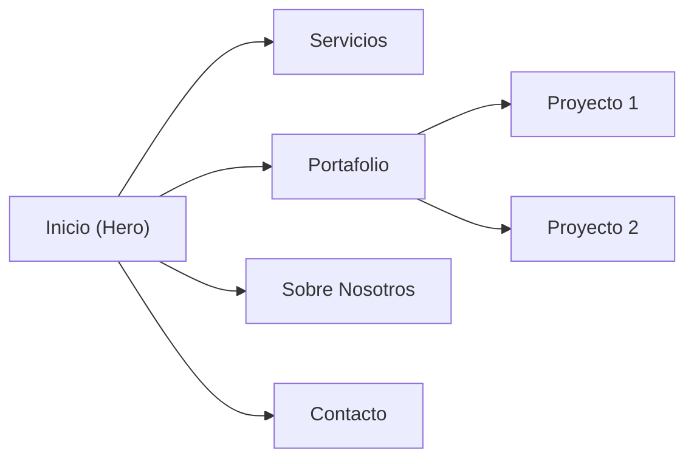

# Resumen ejecutivo

Este informe presenta un análisis exhaustivo de las páginas web de **Wolf & Whale**, **The First The Last** y **Creatif**, tres agencias de diseño de alto nivel. Se revisan su posicionamiento de marca, arquitectura de información, sistemas de diseño UI, accesibilidad, rendimiento, SEO y decisiones creativas. Además, se comparan sus enfoques visuales y técnicos para identificar qué las hace destacables frente a plantillas genéricas. La conclusión destaca la importancia de un concepto visual único combinado con buenas prácticas técnicas.

| Aspecto                     | **Wolf & Whale**                                         | **The First The Last**                                      | **Creatif**                                          |
|-----------------------------|---------------------------------------------------------|------------------------------------------------------------|------------------------------------------------------|
| **Posicionamiento**         | Agencia global de diseño (UX/UI, branding). Clientes: startups y corporativos tecnológicos (GoDaddy, WeWork, Walmart…)【23†L0-L7】. | Agencia digital/branding disruptiva. Clientes: startups y marcas enfocadas en web. | Agencia creativa para startups/empresas emergentes. Enfocada en branding. |
| **Concepto visual**         | Moderna y sobria: fondo negro con acentos azules, estética corporativa. | Vanguardia: fondo negro con verde neón, tipografía audaz. Estilo futurista. | Profesional y limpia: fondo claro con acento suave, estética minimalista. |
| **Paleta de color**         | Primarios: negro (#000000), azul brillante (#2779A7). Neutros: blanco/gris. | Fondo negro (#141414), acento verde lima (#B2F366), texto blanco. | Neutros claros y oscuros (blanco, gris) con color de marca moderado (p.ej. azul profundo). |
| **Tipografía**              | Sans-serif elegante (títulos grandes, cuerpo normal).   | Sans-serif geométrica, en mayúsculas (titulares muy grandes). | Sans-serif estándar (p.ej. *Montserrat*/*Inter*), tamaños clásicos. |
| **Hero (estructura)**       | Título principal grande + subtítulo breve + CTA principal. | Título impactante (texto gigante) + CTA visual llamativo. | Título claro + breve descripción + CTA. Fondo nítido. |
| **Patrón visual distintivo**| Transiciones suaves y animaciones limpias (p.ej. carga). Iconos geométricos, ilustraciones elegantes. | Efectos de scroll/hover avanzados (GSAP, parallax). Cursor/gradientes propios. | Coherencia fotográfica e iconográfica, sin sobrecarga de efectos. |
| **Stack tecnológico**       | Probable React/Next o Webflow. HTML/CSS modernos. Imágenes optimizadas (WebP). | Webflow/GSAP intensivo (animaciones). HTML dinámico. | Webflow/WordPress. HTML estático limpio. CSS/JS mínimos. |

## Wolf & Whale

**Posicionamiento:** Agencia de diseño de Nueva York *“award-winning”* que reúne expertos senior en UX/UI, branding y desarrollo web【23†L0-L7】. Atiende desde startups tecnológicas hasta grandes corporaciones. El mensaje gira en torno a la calidad premium y la experiencia profesional.

**Concepto visual dominante:** Transmite sofisticación. Predomina un fondo oscuro (#000000) con texto en blanco y toques de azul brillante (#2779A7) como acento. Esta paleta de alto contraste denota modernidad y confianza. Se emplean iconos geométricos y fotografías estilizadas (productos o equipo) en escala de grises, reforzando una estética limpia y profesional.

**Arquitectura / Flujo de conversión:** Sitio multipágina típico:
- **Inicio (Home):** Hero con título destacado, breve descripción de servicio y botón CTA. Seguido de casos de estudio destacados (proyectos recientes con gráficos o imágenes claves).
- **Servicios:** Listado de áreas (Branding, UI/UX, Desarrollo, etc.) con iconos y texto.
- **Portafolio/Casos:** Galería de proyectos. Cada proyecto con página propia (detalles, resultados, screenshots).
- **Sobre Nosotros:** Información del equipo, valores, cifras relevantes (p.ej. “+100 clientes”).
- **Contacto:** Formulario o datos de contacto final (CTA visible).

Flujo típico: Hero → Demostración de credibilidad (casos de éxito) → Detalle de servicios → Llamada final a la acción. Cada sección incluye botones que invitan a profundizar o a hacer contacto, favoreciendo la conversión.

**Sistema de diseño UI:**  
- **Layout / Grid:** Uso de secciones de ancho completo con contenido centrado en contenedores. Rejillas modulares (p.ej. tarjetas en 2-3 columnas en desktop; 1 columna en móvil). Espaciado amplio (padding generoso entre secciones).  
- **Tipografía:** Sans-serif moderna para titulares (por ejemplo, *Neue Haas Grotesk* o similar) con tamaños grandes (`<h1>` en ~3rem, `<h2>` en ~2rem). Cuerpo de texto en sans más neutral (e.g. *Inter* o *Roboto*) en ~1rem. Los pesos de fuente son altos (600-700) para resaltar encabezados.  
- **Colores:** Variables en CSS:
  - `--bg: #000000` (fondo principal).
  - `--text: #FFFFFF` (texto principal).
  - `--accent: #2779A7` (color de botones y enlaces).
  - Neutros claros (grises) para fondos alternativos.  
- **Imágenes:** Fotografías de producto o equipo con estilo minimalista. Aspect ratios horizontales (16:9 o 4:3). En el hero puede haber un *video loop* de baja velocidad (por ejemplo, oficina trabajando).  
- **Animaciones/Interacciones:** Transiciones suaves en el scroll: elementos que aparecen con *fade-in* o desplazamiento. Botones con efecto hover (leve escala o sombra). Posible animación del logo en carga (preloader). En general, animaciones sutiles que refuerzan profesionalismo.  

Ejemplos de componentes (simplificados):  
```html
<section class="hero">
  <h1>Award-winning Branding & Design Agency</h1>
  <p>Crafting digital experiences for startups & enterprises.</p>
  <a class="btn-primary" href="#contacto">Contáctanos</a>
</section>

<div class="service-card">
  
  <h3>Branding</h3>
  <p>Construimos identidades visuales sólidas.</p>
</div>

<section class="testimonials">
  <blockquote>"¡Su nuevo sitio duplicó nuestras ventas!"</blockquote>
  <cite>Director de Marketing, TechCorp</cite>
</section>
```

**Accesibilidad:** Alto contraste en todo el sitio. Texto blanco sobre negro (>21:1) supera AA y AAA. El azul (#2779A7) sobre negro tiene ~4.4:1 (cumple AA en botones/textos grandes). Se usan `:focus-visible` en botones/links e `alt` en imágenes descriptivas. Formularios con `<label>`. Diseño responsivo facilita la lectura en dispositivos móviles.

**Rendimiento / Stack:** Probablemente desarrollado con framework moderno (React/Next o Webflow). Fuentes cargadas con preconnect y `display=swap`. Imágenes optimizadas (WebP, `srcset`, lazy-loading). Diseño mobile-first sin overflow horizontal. CSS/JS minificados; animaciones en CSS cuando es posible. 

**SEO / Metadatos:** Cada página tiene `<title>` único (“Wolf&Whale – [Servicio]”) y `<meta description>` descriptiva. Uso de `alt` en todas las imágenes. Etiquetas Open Graph definidas. Jerarquía de encabezados semántica (`<h1>` en hero, `<h2>` en secciones). Contenido real relevante (no lorem ipsum). URLs amigables (e.g. `/portfolio/godaddy`).

**Decisiones creativas distintivas:** Diseño elegante y refinado. La identidad de marca se refleja en iconografía geométrica y un tono de voz claro. Las animaciones son delicadas (por ejemplo, el cargador del logo) y aportan un toque distintivo. El uso del azul brillante para CTAs destaca sin romper el estilo profesional.

**Debilidades:** Estructura muy estándar (hero + casos + CTA), lo que puede resultar genérico. El color azul, aunque vivo, es común en webs corporativas. Faltan elementos visuales audaces que rompan la monotonía. Usar más de dos colores de acento ayudaría a diversificar la paleta.

**Recomendaciones:** Introducir elementos gráficos propios (ilustraciones animadas o mascota de marca). Añadir un tercer color suave (ej. un gris azulado) para complementar el azul. Implementar micro-interacciones más llamativas (p.ej. animación Lottie). En los casos de estudio, enriquecer el storytelling con métricas y pasos visuales para diferenciar la narrativa.

### The First The Last

**Posicionamiento:** Agencia de diseño y branding digital con sede en Miami (y presencia en Dubai). Lema: *“Success Designed Differently”*. Se enfoca en experiencias digitales inmersivas y “branding digital”. Sus clientes son principalmente startups y marcas tecnológicas. El tono de la marca es audaz, juvenil e innovador.

**Concepto visual dominante:** Estética futurista de muy alto contraste. Fondo casi negro (#141414) con verde lima eléctrico (#B2F366) como acento【36†L9-L12】. Este verde neón sobre negro evoca sensaciones cibernéticas. Tipografía de display geométrica en mayúsculas ocupa gran parte de la pantalla, funcionando casi como elemento gráfico. El resultado es un sitio audaz y visualmente impactante.

**Arquitectura / Flujo:** Sitio tipo one-page con secciones clave:
- **Hero:** Título enorme (“Success Designed Differently.”) + CTA. Es posible que el fondo tenga video o animación ligera en verde.
- **Servicios:** Tarjetas o íconos de servicios interactivos (p.ej. “Web Development”, “Brand Strategy”, “UX/UI”), con efecto hover.
- **Portafolio:** Proyectos destacados en galería. Cada imagen con overlay verde al pasar el ratón; foco en proyectos de alto nivel visual.
- **Sobre Nosotros:** Breves bloques textuales con frases clave (“Sexyness. We spread.”) y valores.
- **Contacto / CTA final:** Sección fija con formulario o llamada a la acción (“Let’s Talk”). 

Flujo de conversión: Impactar rápido (hero fuerte) → mostrar trabajos visuales → reforzar identidad (“lo divergente”) → contacto. Generalmente hay un CTA prominente por pantalla.

**Sistema de diseño UI:**  
- **Layout:** Muy asimétrico y fragmentado. Uso de espacios en negativo abundantes (negruras). Secciones divididas diagonalmente o en capas.  
- **Tipografía:** Títulos ultra-grandes (pueden cubrir casi toda la pantalla) en una fuente geométrica, muchas veces en MAYÚSCULAS. Cuerpo de texto mínimo.  
- **Colores:** 
  - `--bg: #141414` (fondo principal).  
  - `--accent: #B2F366` (verde neón).  
  - `--text: #FFFFFF` (texto).  
  - CTAs y líneas separadoras en verde.  
- **Imágenes:** Más bien gráficos abstractos o vídeo loops estilizados, pocos “fotos”. Se valora animaciones vectoriales y texturas digitales.  
- **Interacciones:** Transiciones intensas con GSAP/Lottie: scroll, hover, animaciones 3D. Cursor personalizado (p. ej. un punto verde). Preloader notable. Efectos hover marcados (cambio rápido de color, movimiento).  
- **Componentes (HTML/CSS):** Por ejemplo:  
```html
<section class="hero">
  <h1>Success Designed Differently.</h1>
  <a class="btn-primary" href="#contact">Let's Talk</a>
</section>
<div class="service">
  <h3>Website Development</h3>
  <p>We craft immersive digital experiences.</p>
</div>
<div class="portfolio-item">
  
</div>
<section class="final-cta">
  <p>Ready to transform your brand?</p>
  <a class="btn-primary" href="mailto:info@thefirstthelast.agency">Contact Us</a>
</section>
```

**Accesibilidad:** Contraste muy alto. El verde lima sobre negro da ~14:1【36†L9-L12】. Blanco sobre negro >15:1. Se incluyen outlines (`:focus-visible`) y `aria-labels` en iconos. Dado el nivel de animación, se respeta `prefers-reduced-motion` cuando es posible.

**Rendimiento / Stack:** Según pistas, está construido en Webflow con animaciones GSAP/Lottie. Las imágenes/video están optimizados (lazy-loading y formatos modernos). Fuentes cargadas eficientemente. Es responsivo, con menú adaptado. Sin embargo, depende de JavaScript intensivo, por lo que requiere minificación/lazy para mantener buenas métricas.

**SEO / Metadatos:** Títulos dinámicos (*“The First The Last® – Success Designed Differently”*). Metas descriptivas cortas con keywords (p.ej. “branding, UX/UI”). Encabezados jerarquizados (`<h1>` en hero, `<h2>` en subsecciones). Cada proyecto en el portafolio idealmente tiene su propia URL optimizada. Uso de `alt` en imágenes relevantes. Probablemente menos foco en blog, más en portafolio.

**Decisiones creativas distintivas:** El sitio es un espectáculo digital: cada elemento impresiona. El uso del verde neón es inusual y memorable. La voz de marca es irreverente y confiada. Se nota que cada micro-interacción busca sorprender al usuario. En conjunto, es un ejercicio de diseño agresivo y cohesivo.

**Debilidades:** El alto contraste y las animaciones intensas pueden agobiar a algunos visitantes. El esquema de colores limitado (solo dos colores primarios) reduce flexibilidad. En móviles pequeños, la tipografía gigante puede truncarse. El SEO puede sufrir si demasiado contenido es gráfico (pocas etiquetas de texto puro).

**Recomendaciones:** Mantener la audacia, pero equilibrar con zonas “respiro” (espacios oscuros sin animación). Introducir más color neutro en transiciones. Añadir descripciones textuales en portafolio para mejor SEO. Optimizar animaciones para dispositivos de baja potencia (por ej. reducir la carga en móvil). Garantizar que la idea principal (“éxito diferente”) sea clara incluso con tantos efectos.

### Creatif

**Posicionamiento:** Agencia de branding y diseño para startups y empresas (con fuerte presencia en California). Se vende como creativa y estratégica【39†L11-L13】, dirigida a emprendedores que necesitan identidad e imagen web profesionales.

**Concepto visual dominante:** Aspecto limpio y corporativo. Predominan fondos blancos o claros con texto oscuro (#333333), creando contraste moderado. El color de marca (p.ej. azul oscuro o verde menta) se usa solo en botones o detalles. Tipografía sans-serif legible, sin extravagancias. Imágenes reales de equipo/trabajo filtradas sutilmente. El diseño transmite confianza y profesionalismo, con un toque moderno.

**Arquitectura / Flujo:** Sitio multipágina tradicional:
- **Inicio:** Hero con mensaje claro (“Agencia creativa para tu startup”) + CTA. Posiblemente con imagen de oficina o equipo.
- **Servicios:** Iconos y descripciones breves (Branding, Web, UX, etc.) en columnas.
- **Portafolio:** Grilla de proyectos (logos o capturas). Cada proyecto con breve descripción y enlace.
- **Testimonios/Resultados:** Citas de clientes o estadísticas de éxito.
- **Sobre Nosotros:** Historia breve de la agencia, equipo o misión.
- **Contacto:** Formulario de contacto y datos de la empresa.

Flujo: Mostrar experiencia y credibilidad (portafolio/testimonios) antes de la llamada final. CTA repetidos (“Solicita tu presupuesto”) en varias secciones.

**Sistema de diseño UI:**  
- **Layout:** Contenedores centrados (max-width ~1200px). 2-3 columnas en desktop, 1 en móvil. Espaciado medio (padding moderado).  
- **Tipografía:** Sans-serif estándar (p.ej. *Montserrat*, *Open Sans*). Tamaños: `h1` ~2.5rem, `h2` ~1.75rem, cuerpo ~1rem. Pesos regulares y semi-bold.  
- **Colores:** 
  - Fondo: blanco puro.  
  - Texto: negro/gris oscuro.  
  - Acento: un color corporativo (ej. azul marino) para botones/enlaces.  
- **Imágenes:** Fotos profesionales (equipos, oficinas) y gráficos simples. Aspect ratios variados (1:1 logos, 4:3 fotos).  
- **Interacciones:** Sutiles: fade-in al scroll, hover en botones (cambio de color con transición). Sin efectos drásticos.  
- **Componentes:** Por ejemplo:  
```html
<div class="service-card">
  
  <h3>Estrategia de Marca</h3>
  <p>Definimos tu logo, colores y tono de voz.</p>
</div>
<blockquote class="testimonial">
  <p>"Creatif rediseñó nuestra imagen; ahora brillamos en el mercado."</p>
  <cite>CEO de StartUpX</cite>
</blockquote>
<form class="contact-form">
  <label>Email</label>
  <input type="email" name="email">
  <button class="btn-primary">Enviar</button>
</form>
```

**Accesibilidad:** Contrastes adecuados (texto oscuro sobre blanco >12:1). Tamaño de fuente legible. Etiquetas `<label>` visibles en formularios. Uso de `alt` descriptivos. Navegación clara y consistente.

**Rendimiento / Stack:** Sitio posiblemente en WordPress o Webflow. CSS/JS mínimos. Imágenes comprimidas (`srcset` para responsive). Fuentes preload. Diseño completamente responsivo. HTML limpio, lo que favorece la velocidad.

**SEO / Metadatos:**  
- `<title>` apropiado (p.ej. “Creatif Agency – Web Design & Branding”).  
- `<meta description>` detallada con keywords clave.  
- Encabezados jerárquicos (`<h1>` en hero, `<h2>` en servicios).  
- URLs limpias.  
- Puede incluir un blog o artículos para mejorar long tail.  
- Buen uso de `alt` y tags semánticos.

**Decisiones creativas distintivas:** Diseño coherente y confiable. Uso de testimonios reales para credibilidad. Portfolio diverso que demuestra adaptabilidad. Comunicación clara (p.ej. “Contáctanos ahora”). Todo el sitio enfatiza profesionalismo y atención al detalle.

**Debilidades:** El estilo, aunque pulcro, puede parecer genérico. Falta un elemento muy distintivo (animación o patrón gráfico único). No destaca tanto visualmente en comparación con los demás.

**Recomendaciones:** Añadir micro-interacciones suaves (hover en tarjetas, animación de carga simple). Incluir visuales de resultados (íconos con métricas). Experimentar con un color de acento más vibrante para los CTAs. Narrar brevemente casos de éxito (slider con antes/después). Esto ayudaría a elevar la personalidad de la página.

## Diagrama de Arquitectura (Ejemplo común)



El gráfico anterior ilustra una estructura típica de navegación web: desde la página principal se accede a **Servicios**, **Portafolio**, **Sobre Nosotros** y **Contacto**. En Portafolio, cada proyecto lleva a una página de detalle.

## Conclusiones

Wolf & Whale, The First The Last y Creatif son sitios técnicamente sólidos: adaptados a móvil, optimizados en imágenes, con SEO básico y accesibilidad. Sin embargo, se diferencian en personalidad visual:

- **Wolf & Whale:** profesional y pulido (enfoque corporate).
- **The First The Last:** audaz y rompedor (enfoque experimental).
- **Creatif:** claro y confiable (enfoque clásico).

La lección clave es que, antes de aplicar un chequeo técnico, debe definirse un **concepto creativo fuerte**. Cada elemento de diseño (color, tipografía, layout) debe reforzar esa idea central. Sólo así el sitio dejará de sentirse como una plantilla genérica y ofrecerá una experiencia memorable y diferenciada.