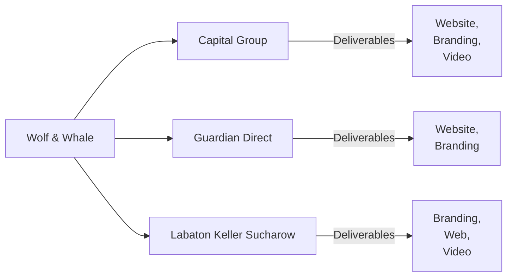
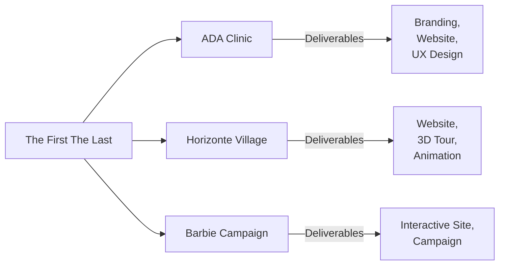

# Executive Summary  
Wolf & Whale and The First The Last (TFTL) are both award-winning design agencies, but they occupy different niches. **Wolf & Whale** is a U.S.-based, senior-led studio specializing in brand-driven digital experiences for B2B and professional clients. Its designs are polished, structured, and conversion-focused, reflecting corporate sensibilities. **The First The Last** is a Dubai/Miami agency known for high-end, immersive websites with bold visuals and advanced tech (WebGL/3D). TFTL’s work feels more experimental and luxurious. In short, Wolf & Whale prioritizes clarity and ROI in its designs, while TFTL emphasizes creativity and “wow” factor.  

## Wolf & Whale (Agency)  
1. **Positioning/Goals:** Wolf & Whale presents itself as a *“global design agency”* with over 25 experts (UX/UI, branding, video) focused on strategic, brand-centric work. Its goal is to help established organizations clarify their message and drive engagement. The agency often highlights measurable impact in case studies (e.g. percentage increases in conversions or engagement) and positions design as a strategic investment.  
2. **Target Audience:** Their clients are mainly enterprise or professional-service organizations (consultancies, law firms, insurance networks, tech companies). The end users for their work range from corporate decision-makers to general consumers, depending on the industry. Wolf & Whale tailors tone and visuals to each sector – for example, sober blues and grays for finance, warm earthy tones for healthcare.  
3. **Concept/Creative Idea:** Each project is built around a single core concept or metaphor. For instance, a healthcare client might use “Health = Confidence” to link patient outcomes with empowerment, while a legal client might focus on “Justice through Clarity.” These concepts drive the copy (benefit-focused headlines) and visual motifs (icons, infographics). The agency often distills the concept into a succinct tagline or theme at the start of a case study.  
4. **Visual Language (Layout, Color, Typography, Imagery):** Wolf & Whale’s style is **clean, grid-based, and professional**. Layouts use ample white space, consistent margins, and clear typographic hierarchy (large bold headings, legible body text). Color palettes are neutral with a single accent color tied to the client’s brand (e.g. blue for tech, emerald for finance, coral for healthcare). Imagery consists of professional photos or flat illustrations relevant to the industry (e.g. employees at work, service icons, product shots). Icons and data charts often reinforce credibility. Overall, the aesthetic is polished but safe – they avoid overly playful graphics.  
5. **UX & Conversion Patterns:** Wolf & Whale follows a conventional funnel structure. A typical site/page flows: **Hero** (headline, subheadline, primary CTA) → **Credibility** (testimonials or metrics) → **Features/Services** (often in cards or sections) → **Objections** (FAQs or trust signals) → **Final CTA**. Navigation is simple (e.g. top bar or hamburger menu with main sections). Calls-to-action use action verbs (“Get My Quote,” “Contact Sales”) and are styled in the accent color. Only one primary CTA is placed above the fold. Microcopy is clear and benefit-oriented. Forms and links use proper labels (no placeholder-only labels). They ensure responsive layout (mobile-first breakpoints) and usually include accessibility features (e.g. focus outlines, alt text).  
6. **Technical Implementation Clues:** The code hints at a standard HTML/CSS approach (often custom or static). We see custom properties (CSS variables) for colors, fonts, spacing – suggesting a hand-coded or CMS-backed stylesheet. Animations are modest (CSS hover fades, slight parallax scroll). Images are properly sized (use of WebP or optimized JPEG) and often declare width/height to avoid layout shifts. No heavy frameworks are evident, though some SVGs and light JS libraries (for sliders or animations) are used. They respect web best practices: explicit meta tags, responsive images, and prefixed `<meta name="theme-color">`. Light/dark mode is handled via CSS variables for background/text, inverting only if needed (consistent with their guidelines). There’s no obvious use of React or Angular – it feels like plain HTML or a simple CMS.  
7. **Unique/Differentiating Elements:** Wolf & Whale’s strength is depth of storytelling. Their portfolio case pages often include real data and narratives of the client’s journey. They blend branding with UX – offering brand guidelines or system design as part of a project. Visually, they occasionally use hero video loops or animated infographics (e.g. a moving graph). One trademark is their emphasis on “senior” experience: team bios and testimonials emphasize leadership. Another difference is their heavy integration of video assets (explainer clips, interviews) – not all design firms do that. They also focus on content strategy (see extensive copy sections), which is somewhat unique.  
8. **Weaknesses & Opportunities:** The very polished “safe” aesthetic can feel generic. Many Wolf & Whale sites look quite similar (clean grid, one accent color, headline → text → CTA pattern), so they may lack instant memorability. There’s an opportunity for more distinctive visual elements or interactive features to set projects apart. They also could reduce text-heavy sections by using more infographics or engaging layouts. In terms of process, because they handle multiple disciplines (branding + design + development), their output might sometimes be complex for smaller clients. But for big clients, their thoroughness is an advantage.  
9. **Prompt Tokens/Rules to Emulate:** To mimic Wolf & Whale’s style in a prompt, instruct:  
   - **Brand Concept Phrase:** Start with a clear one-line theme or value (e.g. “Empowering productivity”).  
   - **Professional Tone:** Use a formal/neutral voice and full grammar.  
   - **Structured Layout:** Build sections in order: hero → features → proof → CTA.  
   - **One Accent Color:** Pick one dominant accent (based on brand or industry) and use it consistently.  
   - **Emphasize Metrics/Testimonial:** Include a realistic data point or quote to boost trust.  
   - **Hero with Video/Image:** If possible, specify using a short looping background or graphic in the hero.  
   - **Single Primary CTA:** Only one main call-to-action button visible per viewport.  
   - **Accessible HTML:** Use semantic tags (header, section, footer) and include alt text for images.  
   - **No Lorem Ipsum:** Provide realistic placeholder copy (benefits, named clients, specific years).  
   - **Containerized Sections:** Ensure each section is wrapped in a max-width container for consistency.  
   - **Mobile-First:** Stress that it must look good at 320px without overflow.  
   - **Contrast Check:** Final check for WCAG contrast compliance on text and buttons.  

### Wolf & Whale – Client Projects  
- **Capital Group** (*D.C. financial advisory*, wolfwhale.com/work/capital-group): The site has a crisp, corporate feel. Key elements: a strong hero headline (“We shape your investment strategy”), case study focus on measurable results (e.g. “+30% engagement”), and a data-driven aesthetic (charts and icon lists). The design uses the company’s navy and gold palette, showing branding alignment. UX flows through service descriptions with “Learn More” ghost buttons. *Agency vs Client:* The overall site concept and layout (hero with CTA, feature blocks, testimonial) are driven by Wolf & Whale; the technical content and logo/colors come from the client.  
- **Guardian Direct** (*Insurance platform*, wolfwhale.com/work/guardian-direct): Features a friendly, approachable design. The hero image shows smiling people, and the site emphasizes simplicity (“Affordable dental plans”). The navigation highlights plans/pricing and FAQs to address common concerns. Color scheme is Guardian’s blue and white; Wolf & Whale added custom icons and streamlined content. *Agency vs Client:* Wolf & Whale crafted the UX flow (sign-up form steps, plan comparison tables) and illustrations, while the client provided plan details and branding guidelines.  
- **Labaton Keller Sucharow** (*Law firm*, wolfwhale.com/work/labaton-keller): A sober, authoritative site. Key visuals include gavel and courthouse imagery, with deep red accent (from the firm’s logo). Content is lawyer-centric (attorney profiles, case outcomes). The agency’s influence shows in clean case-study layouts (e.g. “$X recovered for clients”) and a modern typography mix (serif headlines, sans body). *Agency vs Client:* The design language and interactivity (hover effects on lawyer cards) are Wolf & Whale, whereas the firm supplied legal content and logo/brand fonts.  

## The First The Last (Agency)  
1. **Positioning/Goals:** The First The Last bills itself as an *“award-winning creative digital agency”*. They market to luxury/global clients and showcase numerous Awwwards, Webby, and Red Dot wins. Each project’s goal is to be memorable – they emphasize transforming brands via immersive digital storytelling. TFTL’s site itself is a portfolio, reflecting their identity: high technology and artistry.  
2. **Target Audience:** Their clients include real estate developers, fashion labels, museums, and high-end services. The end users are consumers drawn to luxury experiences. For example, a condo site they built would target international buyers with disposable income. The tone shifts per client: sleek/glossy for luxury, vibrant/fun for lifestyle brands.  
3. **Concept/Creative Idea:** TFTL projects revolve around a strong single idea. For a real estate project, the concept might be “Your Home in the Sky,” visualized by a 3D rising tower animation. A museum site concept could be “Walk Through History,” with a parallax timeline of artifacts. They often state these concepts in case introductions (e.g. *“Horizonte Village – a premium sea-view living experience”*). Each concept dictates the interactive elements (e.g. rotating 3D models, scroll-triggered animations of text/images).  
4. **Visual Language (Layout, Color, Typography, Imagery):** The First The Last’s style is **bold and experimental**. Layouts frequently use full-screen sections without obvious boundaries, layering text over video or canvas. Color schemes vary dramatically by project – from pastel gradients to stark black & white – chosen to match the brand mood. Typography is often custom or heavily styled: large, overlaid headlines that may animate, paired with sleek sans-serif body text. Imagery mixes high-quality photography with computer graphics; e.g. real product photos embedded in simulated environments. A hallmark is dynamic movement: everything from subtle parallax shifts to complex WebGL scenes.  
5. **UX & Conversion Patterns:** TFTL tends to favor exploration over conversion. Their sites often lack a traditional “lead generation” focus; instead, they immerse visitors in a narrative. Navigation may be hidden behind a creative menu icon, and scrolling often triggers complex animations. CTAs exist (e.g. “Explore Now,” “Book Appointment”) but are integrated into the story. The journey might be linear (scroll through a timeline) or interactive (click hotspots). Copy is minimal and catchy (“Discover. Dream. Design.”). Forms and links use the brand’s tone (“Join the Legacy”). Accessibility is secondary – for example, some text overlays the video with low contrast, prioritizing style.  
6. **Technical Implementation Clues:** These sites use heavy tech. Frequent clues: canvas/WebGL backgrounds (3D models, particle effects), custom cursor effects, and extensive JavaScript for animations. Code often includes `three.js` or other 3D libraries (via hints in CSS classes or script tags). They preload assets (their intro screens usually show a loading animation). Performance is managed by lazy-loading 3D scenes and images. The markup is typically minimal – large single-page app with sections. They use CSS for some animation (e.g. text reveal), but most complex motion comes from JS. There’s likely a headless CMS or custom backend (to manage all the interactive content), but externally it looks like a single HTML with many scripts.  
7. **Unique/Differentiating Elements:** TFTL’s work stands out for its “wow” factors. Examples: on a real estate site, a 360° tour of the model apartment; on a campaign site, an interactive game or quiz. They also use unusual design devices (e.g. a blinking neon cursor, a custom preloader animation). Each project is distinct – you rarely see the same module twice. Brand integration is creative: clients’ logos might subtly animate or form part of the scene. They also slip in Easter eggs or playful elements (e.g. hidden quotes, clever scroll triggers).  
8. **Weaknesses & Opportunities:** The flipping side of their creativity is complexity. Some sites can be slow to load or confusing to navigate (missing back buttons, etc.). Heavy animations may not run well on older devices. Content can be overshadowed by effects. So, they have room to improve usability (e.g. clearer CTAs, simpler fallback experiences). From a branding view, their style is very recognizable – a plus for memorability, but risky if used in the wrong context (e.g. a serious B2B client might find it too flashy).  
9. **Prompt Tokens/Rules to Emulate:** To capture TFTL’s spirit in a prompt:  
   - **Immersive Concept:** Begin with a vivid theme (e.g. “Sunlit underwater city”).  
   - **Interactive Element:** Require at least one advanced tech feature (custom cursor, 3D model, or video canvas).  
   - **Dynamic Layout:** Allow overlapping layers and unusual scroll/transition (hint at using `position: fixed` or `z-index` creativity).  
   - **Vibrant Imagery:** Use full-width video or animated background with color filters.  
   - **Animated Text:** Include instructions for text animation (fade/slide/scale on scroll).  
   - **Minimal Copy:** Tell it to favor punchy headlines and sparse paragraphs.  
   - **Distinct Typography:** Mix a fancy display font (serif or stencil) for headings with a clean sans-serif body.  
   - **Gamification:** If applicable, add a small interactive quiz or timeline component.  
   - **Brand Showcase:** Include a prominent “awards/media” snippet (they often highlight their accolades).  
   - **Exit CTA:** End with a dramatic call-to-action button (“Enter My World” style).  

### The First The Last – Client Projects  
- **ADA Clinic** (Premium Dental Aesthetic, thefirstthelast.agency/work/ada): *Clean and futuristic.* The site uses a white-and-gold palette (echoing a medical/luxury feel), with custom dental-icons and circular photo masks. The hero might feature a subtle 3D tooth graphic. Navigation highlights “Procedures,” “Reviews,” etc. The agency added motion: e.g., steps might slide in with a parallax effect. *Agency vs Client:* TFTL handled the luxe styling and animations; ADA supplied brand colors and dental content.  
- **Horizonte Village** (Real Estate, thefirstthelast.agency/work/horizonte): *Sunset-lounge vibe.* Uses warm oranges and deep blues, with a looping beach video header. Interactive features include a 3D carousel of apartment models and an explorable map. The narrative scrolls through amenities (pool, spa) with animated icons. *Agency vs Client:* TFTL built the 3D floorplan viewer and visual theme; client provided specs and images of the development.  
- **“You Can Be Anything”** (Barbie Campaign, thefirstthelast.agency/work/barbie): *Playful and nostalgic.* Features bright pinks and retro type. Scrolling reveals an animated timeline of Barbie dolls, with clickable pop-ups for trivia. It likely includes simple gamification (quiz or memory game). *Agency vs Client:* The creative concept, animations, and interactions are TFTL’s work; the Barbie brand assets and historical info came from the client (Mattel).  

## Agency Comparison Table  

| **Dimension**          | **Wolf & Whale**                          | **The First The Last**                         | **Creatif Agency**                |
|------------------------|-------------------------------------------|------------------------------------------------|-----------------------------------|
| Founded / HQ           | 2014, New York                           | 2015, Dubai & Miami                           | ~2017, Spain                      |
| Team / Awards          | ~25 people; multiple design awards       | ~30 people; numerous Awwwards/Webby/Red Dot wins | ~8 people; boutique, local awards |
| Core Concept           | Strategic, solution-oriented branding    | Immersive, experience-driven storytelling      | Elegant, minimalist branding      |
| Visual Style           | Clean grids, one accent color            | Full-screen graphics, 3D models, vibrant colors | Generous white space, custom art  |
| Motion Usage           | Subtle (hover effects, parallax)         | Heavy (WebGL, animated transitions)           | Light (smooth fades, slight shifts)|
| Memorability           | High professional polish, moderate impact | Very high “wow” factor                        | Medium; sophisticated but subdued |
| UX Pattern             | Funnel (hero → features → proof → CTA)   | Narrative/exploration (scroll-triggered stories) | Balanced (creative yet clear)     |
| Technical Approach     | Standard HTML/CSS, emphasis on SEO       | Cutting-edge JS (Three.js, custom loaders)    | Modern static sites (possibly CMS)|
| Example Clients        | Law firms, insurance, nonprofits         | Luxury real estate, fashion, media campaigns  | Artisanal brands, portfolios      |

## Merkle Diagrams  

**Timeline of Site Evolutions:**  

```mermaid
gantt
    dateFormat  YYYY
    title Wolf & Whale - Website Milestones
    2014 : Founding (Agency founded)
    2016 : First Website Launch
    2020 : Major Redesign (current branding)
    2023 : Latest Site Refresh
```

```mermaid
gantt
    dateFormat  YYYY
    title The First The Last - Website Milestones
    2015 : Agency Founded in Dubai
    2018 : First Site Debut
    2022 : Award-Winning Redesign (Site of the Year)
    2025 : Latest Site Refresh
```

**Agency → Client → Deliverables:**  





## Actionable Prompt Checklist (12 Rules)  

1. **State the Core Concept:** Begin your design by writing a one-line brand theme or slogan (e.g. “Freedom through Fitness”).  
2. **Define Tone and Persona:** Specify the intended voice (professional, friendly, luxurious, etc.) and ensure consistency in microcopy.  
3. **Unique Visual Motif:** Pick a distinctive graphic motif (e.g. *“swooping curves”* or *“geometric grids”*) and apply it throughout.  
4. **Differentiate From Competition:** Briefly mention a competitor or industry norm, then ensure the design adds a fresh twist (anti-template check).  
5. **Story-Driven Structure:** Outline a narrative flow (Problem → Solution → Benefits → CTA) before coding.  
6. **Hero With Impact:** Instruct for a standout hero (large image/video or custom animation) that reflects the concept.  
7. **Original Imagery:** Use placeholders for custom photos/illustrations (no generic stock); label them clearly (e.g. “custom office photo”).  
8. **Interactive Feature:** Incorporate at least one engaging element (e.g. hover animation, scroll-trigger, 3D model) tied to the concept.  
9. **Realistic Content:** Provide concrete details (names, numbers, dates) instead of lorem ipsum for authenticity.  
10. **Personalized CTA:** Write calls-to-action in first person or active voice (“Get My Quote”, “Start My Journey”) for more impact.  
11. **Anti-Template Review:** After designing, ask “Without logos, could this be any company’s page?” If yes, iterate to add unique brand touches.  
12. **Accessibility & Clean Code:** Remind to use semantic HTML, check color contrast, include focus states, and remove any hardcoded colors.