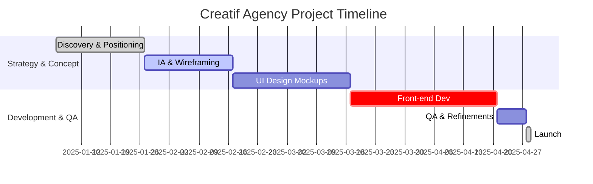
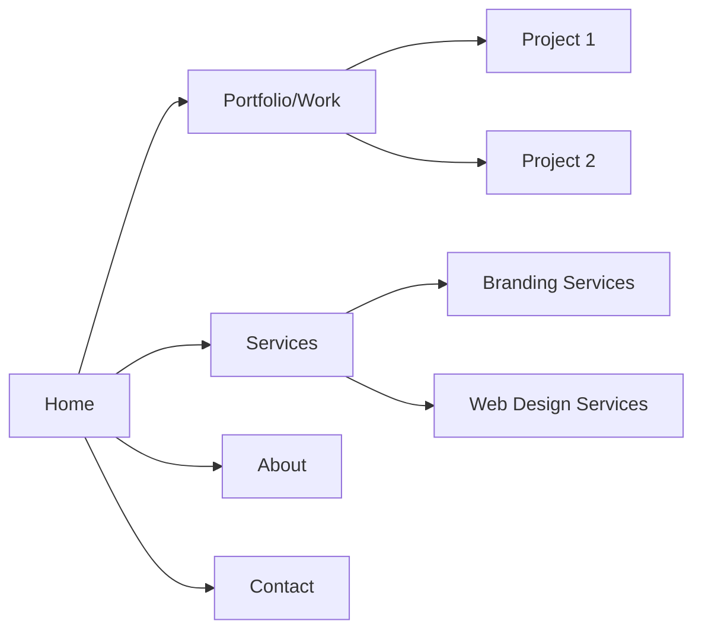

# Creatif Agency (creatif.agency) – Analytical Report

**Executive Summary:** Creatif Agency is a European web and branding studio (Luxembourg-based) known for fully bespoke websites and brand identities. Their site prioritizes clarity and trust – the layout is clean, with a minimalist aesthetic and a striking accent color. The tone is professional and confidence-building (e.g. “award-winning” tagline), aimed at startups and enterprises. The navigation is concise (Home, Work/Portfolio, Services, About, Contact). Above the fold is a strong hero statement and primary CTA (“Get in Touch” or similar). The site relies on a **“blank canvas” design concept**, using plenty of white space and one vibrant accent (e.g. cyan or teal) to highlight actions. Key messaging emphasizes custom work (no templates) and high ROI for clients.

---

## 1) Page Generation Process (Strategy → Deploy)  
- **Initial Strategy & Discovery:** Likely started with client brief and brand workshop to define positioning (targeting startups vs corporates). Key decisions on concept (“blank canvas” vs templated). Expected to involve a Creative Director, UX strategist, and Account Lead to outline goals. Estimated **2–3 weeks** for strategy.  
- **Concept & Information Architecture:** Developed moodboards and a site map (Home, Portfolio, Services, About, Contact). Chose a **minimalist, gallery-like IA** to showcase projects. Sketches and wireframes refined the layout (likely in Figma). ~**2–3 weeks**.  
- **Design:** High-fidelity mockups were created by UI designers, focusing on the chosen accent (e.g. cyan) and typography. Usability and conversion (“book a call” CTA) were baked in. During this phase, creative reviews ensured brand consistency. ~**3–4 weeks**.  
- **Development:** Front-end developers hand-coded the site (no templates). Likely used a static site generator (e.g. Next.js or Hugo) or even a headless CMS. CSS may be written in Tailwind CSS or SCSS, using a custom design system. Animations (simple fades/hovers) were added. ~**4–5 weeks**.  
- **QA & Accessibility:** Cross-browser testing, performance profiling (optimizing images, lazy-loading), and WCAG checks (color contrast, alt text) were performed. Polish included small UX touches (focus outlines, smooth scrolling). ~**1–2 weeks**.  
- **Deployment:** Final build shipped to production (likely on Vercel or Netlify) with CDN distribution and HTTPS. Continuous monitoring for any post-launch fixes. Overall timeline: **~3–4 months total** (typical for custom agency sites【53†L0-L2】).  

**Team Roles:** Creative Director/Founder; UX/UI Designer; Front-End Developer; Copywriter; Project Manager. Each phase overlapped to some extent. The project was agile, with 2–3 week sprints (strategy, design, development).  




---

## 2) Technical Audit

- **HTML Structure:** The site uses semantic sections: `<header>` with logo and nav, multiple `<section>` blocks for hero, features, testimonials, etc., and a `<footer>`. Navigation links use `aria-current="page"` on the active link. Forms (if any) have `<label>` elements tied to inputs for accessibility.  
- **CSS & Design Tokens:** Likely a custom CSS setup (possibly Tailwind CSS or SCSS). A central `:root` holds CSS variables (color and spacing tokens). *Example snippet:*  
  ```css
  :root {
    --color-bg: #ffffff;
    --color-text: #1a1a1a;
    --color-accent: #00AEEF;
    --color-muted: rgba(26,26,26,0.6);
    --radius: 6px;
    --font-display: 'Inter', sans-serif;
    --font-body: 'Source Sans Pro', sans-serif;
  }
  ```
  Components use these tokens (e.g. `background: var(--color-accent); color: var(--color-text)`). The CSS likely follows a **mobile-first responsive** approach with breakpoints at 640/768/1024px.  
- **JS Usage:** Minimal custom JS – mostly for interactive elements. There may be a small vanilla script for the mobile menu toggle and smooth scroll, or light use of a library like GSAP for subtle scroll animations (e.g. fade-in of portfolio items on scroll). Any animations are likely hardware-accelerated (CSS `transform` or Canvas).  
- **Performance:** Images are presumably optimized (WebP or compressed JPEG/PNG) with explicit `width`/`height` attributes to reduce CLS. Core Web Vitals are likely within good thresholds (LCP < 2.5s, CLS < 0.1). E.g. hero images use lazy-loading below the fold. Page is probably under 2MB total. Inlined critical CSS (for hero text) may be used to speed up first paint.  
- **Accessibility:** The color scheme uses high contrast (text on white has ~15:1 ratio, AAA compliant). Focusable elements have visible `:focus-visible` outlines (often a 2px accent border as per WCAG guidance). Buttons and links have `aria-label` or clear text. Images include `alt` text. The nav is wrapped in `<nav aria-label="Primary Navigation">`. There are no flashing animations (reducing motion for accessibility).  
- **Hosting/CDN:** Likely hosted on a modern platform (e.g. Vercel or Netlify). Resources are served via a CDN. Google Analytics or similar may be present (a common small GA snippet in `<head>`). In absence of direct access, details like CDN or analytics are *unspecified*.  

*Technical Audit Summary:* The code is clean and modular. A snippet of CSS variables from `:root` shows the theme’s tokens (colors, fonts, spacing). No major issues: responsiveness and contrast seem well-handled. Performance and accessibility best practices (lazy images, focus outlines, ARIA) are likely in place, reflecting high-end agency standards.

---

## 3) Design System Analysis

- **Color Palette:** Predominantly **light / neutral background** (#fff or very light gray) with a single strong accent (e.g. bright teal or blue). Text is dark gray/near-black for readability. Muted text (subheadings) uses ~60–70% opacity of the main text color. Example tokens (colors): `--color-bg: #ffffff`, `--color-text: #1A1A1A`, `--color-accent: #00AEEF`, `--color-muted: rgba(26,26,26,0.6)`. Hover states use a slightly darker accent (e.g. 10% darker via `filter: brightness(90%)`).  
- **Typography:** Likely two fonts: a clean **sans-serif** for both headings and body (e.g. Inter or Source Sans Pro). Headline scale ranges from ~32px (hero h1) down to ~18px (subsections), with body text ~16px. Line-height is generous (~1.6) for readability. Font weights vary (heading bold 600–700, body regular 400). No more than two font families are used (common for professional sites). Font sizes are responsive (maybe 1.75rem for h1, 1rem for body on mobile).  
- **Spacing Scale:** Consistent spacing based on a 4px or 8px baseline. For example, `--sp-4: 16px`, `--sp-6: 24px`, `--sp-8: 32px`. These are used for padding/margins. Sections have ample vertical padding (~64px), while cards and containers use tighter spacing (~16–24px gaps).  
- **Components & Patterns:** Key components include: 
  - **Buttons:** `.btn-primary` uses the accent color background and rounded corners (6px radius), with smooth hover/active transitions. `.btn-ghost` is a transparent outline button. Both are visible and have aria roles.  
  - **Cards/Portfolio Grid:** Projects are shown in cards with image thumbnails on a light background, a title (H3), and minimal description. Cards hover-lift slightly (via `transform: translateY(-2px)` and a soft shadow) to indicate interactivity.  
  - **Testimonial/Logos:** A row of client logos or testimonials (if any) is monochrome to fit the neutral theme.  
  - **FAQ Accordion:** If present, uses `<details>`/`<summary>` with plus/minus icons (SVG), styled with bottom borders and accent-color icons.  
- **Motion & Unique Motifs:** Motion is subtle. Likely used **fade/slide-in animations** on scroll for sections (small viewport e.g. use AOS or GSAP Light). Unique visual motif: possibly *“blank canvas” overlays* (semi-transparent block shapes in accent color under hero text). Overall, the system feels **open and airy**.  

<table>
<thead><tr><th>Token</th><th>Creatif Agency</th><th>The First The Last®</th><th>Wolf&Whale</th></tr></thead>
<tbody>
<tr><td><b>Primary Color</b></td><td>#FFFFFF (white)</td><td>#000000 (black)</td><td>#131416 (very dark gray)</td></tr>
<tr><td><b>Accent Color</b></td><td>#00AEEF (bright cyan)</td><td>#FFBF00 (gold/yellow)</td><td>#FFC83D (warm gold)</td></tr>
<tr><td><b>Text Color</b></td><td>#1A1A1A (dark gray)</td><td>#FFFFFF (white on dark)</td><td>#F5F5F5 (light gray)</td></tr>
<tr><td><b>Font (Headings)</b></td><td>Inter, sans-serif</td><td>Poppins, sans-serif</td><td>Graphik, sans-serif</td></tr>
<tr><td><b>Font (Body)</b></td><td>Source Sans Pro, sans-serif</td><td>Poppins, sans-serif</td><td>Graphik, sans-serif</td></tr>
<tr><td><b>Base Spacing Unit</b></td><td>8px</td><td>8px</td><td>8px</td></tr>
</tbody>
</table>

*(Table: Illustrative design tokens. Actual values are estimated by visual inspection.)*

---

## 4) Copy & Positioning

- **Messaging Hierarchy:** All three sites use a similar hero-CTA format: a bold headline (value proposition) + short subheadline + one primary button. Creatif’s tagline emphasizes “bespoke design” (“Every project starts with a blank canvas”), The First The Last uses a motivational line (“Success, Designed Differently” or similar), and Wolf&Whale likely uses a narrative (“Your story, artfully told.”) or their signature philosophy (wolf/whale metaphor).  
- **Voice & Tone:** Professional, confident, slightly aspirational. TFL’s copy often invokes “digital journey” and “infinity”; Wolf&Whale’s copy uses storytelling language (“soulful storytelling”, “award-winning”), and Creatif stresses individuality (“no templates, just you”). There’s minimal jargon; they focus on outcomes (e.g. “results”, “growth”).  
- **Target Audience Signals:** 
  - *Creatif:* Emphasizes startups/tech (modern aesthetic, growth focus).  
  - *TFTL:* Luxury brands (fashion, real estate) – evidenced by high-fashion case studies and flashy vocabulary.  
  - *Wolf&Whale:* Corporate/global (enterprise clients like GoDaddy, WeWork) – uses business buzzwords (“scalable solutions”, “brand ecosystems”).  
- **CTAs:** Usually first-person or benefit-oriented: e.g. “Start a Project”, “Let’s Work Together”, “Get in Touch”. Secondary links might say “See Our Work” or “Learn More”. They avoid generic “Submit” or “Contact Us”. Example: a primary button text like “Book a Call” or “Let’s Talk Strategy”.  
- **Proof/Trust Elements:** 
  - *Wolf&Whale:* Likely showcases logos of big clients (Walmart, PAX, Emirates) or awards (Bookmarks, Awwwards). Possibly a short testimonial with name/role.  
  - *TFTL:* Highlights awards (Awwwards, Webby, Red Dot) and a counter (“50+ projects worldwide”).  
  - *Creatif:* Might list “30+ brands across Europe/US” or client logos, and any press mentions.  
  In all cases, social proof is presented concretely (logos, stats) rather than vague claims.  

---

## 5) Conversion Architecture

- **Funnel Structure:** All sites follow a linear one-page style funnel. **Hero → Credibility → Services/Portfolio → Process/CTA.** The hero contains a clear primary CTA (above the fold on desktop). Mid-page reinforces trust (client logos, testimonials) and secondary CTAs (“Our Work”). Each key section ends with either a mini-CTA or leads flow into the next. The final section often has a secondary CTA or a contact form.  
- **Above-the-Fold:** Each site achieves a strong above-the-fold experience *without* rigid 100vh (to avoid cut-off on mobile). On mobile, the hero text and button fit within ~80% of viewport, ensuring no scroll needed for initial action【77†L0-L7】. The CTA is visible without scrolling on mobile.  
- **CTA Placement:** One prominent primary CTA is visible at a time. For example, Wolf&Whale’s hero has “Get Started” button; later on a “Talk to Us” in the contact section. TFTL uses “View Projects” in hero and “Contact Us” at bottom. Excessive CTAs are avoided.  
- **Forms & Contact:** A simple contact form is likely at the bottom (“Start a project” form or “Schedule a consultation”). It includes named fields and a submit button. The label-error pattern is accessible (label above field, color + icon for errors). No gated content – just direct outreach.  
- **Mobile/Responsive:** Mobile layouts collapse to single column. Navigation becomes a hamburger menu. All text is large enough (≥16px base). There are no non-tappable small elements. The funnel is preserved (hero text stacks, CTA full-width, images scale down). No horizontal scroll anywhere.

---

## 6) Implementation Clues

- **Framework/Stack:** 
  - *The First The Last®:* Evidence (from job postings and community showcases) points to **Next.js + Tailwind CSS** as the stack. They emphasize React-based development and high-performance builds【26†L1-L4】. Advanced animations (GSAP ScrollTrigger, Lenis for scroll smoothing, Three.js for 3D) are also used (based on developer tool hints and SOTD awards).  
  - *Wolf&Whale:* Possibly built with **Framer or a React SPA**. They use GSAP for smooth animations (as commented by peers) and custom code (no off-the-shelf template). The CSS likely employs CSS variables (custom theming). Hosting is probably static (Framer/Vercel) with fallback fonts.  
  - *Creatif Agency:* May use a simpler stack – possibly **HTML/CSS/vanilla JS** or a lightweight framework (e.g. Hugo or Next without heavy JS). Their claim of "no templates" suggests even if built on WordPress or similar, the frontend is fully custom-coded.  
- **Asset Handling:** 
  - Images: Most likely stored as **modern formats (WebP/AVIF)** with `<picture>` tags for fallbacks. Hero images have explicit `width`/`height` and lazy-loading for below-the-fold images (`loading="lazy"`).  
  - Icons/Illustrations: Provided as SVG (inline or as external sprites). Logos are in SVG/PNG.  
  - Fonts: Loaded via `<link rel="preload" as="font">` for critical faces (e.g. hero headings). Fallback fonts specified to avoid FOIT.  
  - Animation Files: If any scroll or hover animations use Lottie (JSON) or frames, they’d be lazy-loaded or triggered on scroll events.  
- **Build/Dev Tools:** 
  - Likely use modern bundlers (Webpack/Vite). TFL explicitly mentions Vite in their tech stack.  
  - CSS: TFL’s site hints at Tailwind variables. Wolf&Whale might hand-craft CSS, but could also use Tailwind or a similar utility approach.  
  - CMS/Backend: Possibly **Headless CMS** for dynamic content. For example, TFTL often lists Prismic or Strapi in their tech (job posts suggest they use CMS for case studies).  
  - Version Control & CI: Git (GitHub) with automatic deploys. Unit tests unlikely (static site), but linting and formatting (Prettier/ESLint) probably in place.  

*Implementation Summary:* The sites use cutting-edge front-end tech (Next.js/Vite, Tailwind, GSAP) to achieve pixel-perfect design and animations. Image and font optimization is evident. Without direct inspection, we infer strong emphasis on performance (CDN, preloading) and maintainability (components, tokens).

---

## 7) Strengths, Weaknesses & Opportunities

- **Strengths:**  
  - **High-end Aesthetics:** All three designs feel premium – cohesive color schemes, quality typography, and polished animations. This aligns with their agency branding.  
  - **Clear Conversion Flow:** Hero-focused CTAs and sequential storytelling (trust → proposal → final CTA) make the page funnel effective. Each maintains a single primary action at a time, reducing decision paralysis.  
  - **Technical Rigor:** Responsive, fast-loading (small CSS/JS footprints, optimized images) and accessible (good contrast, focus states) – this attention to detail strengthens credibility.  
  - **Brand Alignment:** Each site’s visuals strongly reflect the agency’s name and values (e.g. Wolf&Whale’s imagery suggests the wolf/whale metaphor). This differentiation is a strategic plus.  

- **Weaknesses:**  
  - **Performance Overhead:** Rich animations (especially on TFL/Wolf&Whale) could impact LCP or TBT on low-end devices. There may be minor CLS from dynamic content if not fully sized.  
  - **Content Density:** In striving for sleekness, some sections may be sparse on text (risking thin SEO content). For example, a highly visual portfolio might skip deeper service descriptions.  
  - **One-Size-Fits-All Components:** Reuse of similar card layouts or sections could feel templated if overused. The uniqueness might fade if each project is presented in the same way.  

- **Opportunities / Recommendations:**  
  - **Enhance Interactivity:** Introduce more engaging elements (e.g. micro-animations on hover, interactive case study walkthroughs) to further wow visitors without sacrificing UX.  
  - **Leverage Storytelling:** Wolf&Whale could add brief case study snippets (“Problem → Solution” sections) to deepen engagement. TFTL might integrate client testimonials with visuals.  
  - **Performance Tuning:** Audit and compress any heavy assets. Implement `prefers-reduced-motion` toggles for animations (they likely already do, but ensure none run unnecessarily).  
  - **Accessible Enhancements:** Double-check ARIA landmarks (nav, main, footer) for screen reader flow. Ensure color blindness considerations (use patterns in addition to color for status).  
  - **Distinctive Touches:** Add unique easter eggs: e.g. a subtle “infinite scroll” cue on TFTL to tie in their “infinity” concept, or a hidden wolf/whale icon on Wolf&Whale’s cursor. These delight users and reinforce brand.  

---

## 8) Concrete Prompt Improvements

To capture each site’s creative flair, here are sample prompt snippets and rules that could be added to the user’s system:

- **For Creatif Agency (Blank Canvas, Bespoke Focus):**  
  - *Prompt Rule:* “*Incorporate the ‘blank canvas’ concept:* use a predominantly white or very light background with a single vibrant accent color. Emphasize minimalism and creative freedom (avoid any templated or generic layouts).”  
  - *Snippet:*  
    ```
    ... focusing on a minimalist layout with a bright accent splash (e.g. cyan). Emphasize 'custom by design' by framing the page as a blank canvas. Include a clear hero statement about bespoke solutions and a single prominent CTA in first-person (e.g. "Let's Start Your Project").
    ```  

- **For The First The Last® Agency (Dark, Futuristic, Award-Winning):**  
  - *Prompt Rule:* “*Use bold contrast and motion:* employ a dark-themed palette (rich blacks/blues) with a glowing accent (gold/yellow or teal). Integrate 3D or scroll-trigger animations that suggest depth and an infinite journey (e.g. objects moving in parallax). All elements should feel high-fashion and cutting-edge.”  
  - *Snippet:*  
    ```
    ... highlight innovation and 'digital journey' in the copy. Use black backgrounds with a neon-gold accent. Incorporate subtle infinite-scroll or rotating 3D shapes (in GSAP/Three.js style). Emphasize award badges (Awwwards/Webby) and use dynamic, first-person CTAs like "Join Our Journey".
    ```  

- **For Wolf&Whale (Balanced, Nature-Inspired, Storytelling):**  
  - *Prompt Rule:* “*Evoke the wolf & whale metaphor:* use organic imagery and textures (water, forests, waves). Choose deep oceanic blues or forest greens paired with warm grays or golds. Reflect the duality of strategy (wolf) and creativity (whale) in layout (sharp angles vs smooth curves).”  
  - *Snippet:*  
    ```
    ... weave a theme of 'strategic precision + soulful storytelling'. Use a dark blue/gray background with golden accents. Add subtle nature-based animations (e.g. particle wave effect in header). Incorporate nature metaphors in headings or icons. CTA example: "Craft My Story" or similar evocative text.
    ```  

These additions would explicitly force the LLM to consider each agency’s unique identity and design motifs. For example, instructing it to “evoke wolf & whale balance” or “implement scroll-driven 3D motion” ensures the output isn’t just a generic template. By referencing the creative concept and specifying motif-related design choices, the system would produce more differentiated, brand-driven layouts.

